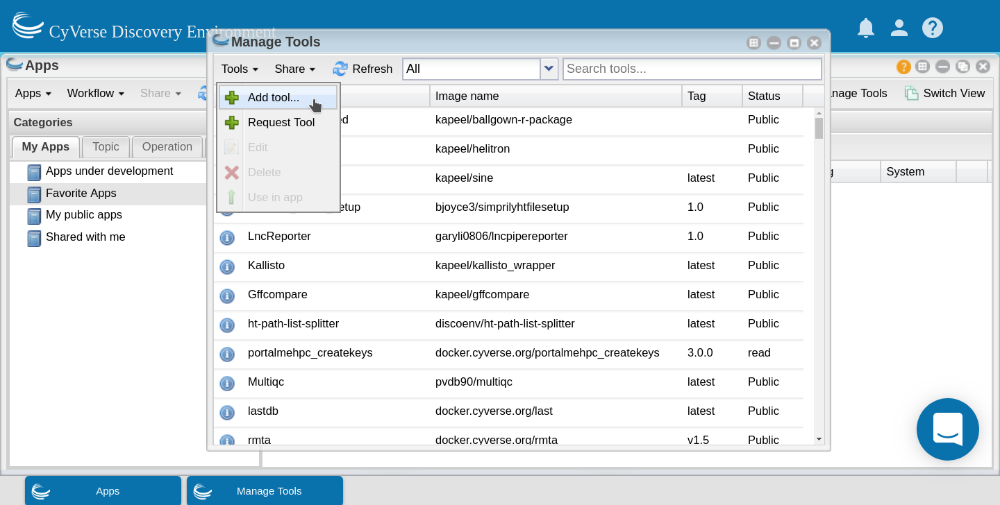

.. include:: ../cyverse_rst_defined_substitutions.txt

|CyVerse_logo2|_

|Home_Icon2|_ `Learning Center Home <http://learning.cyverse.org/>`_

**Tool integration in the Discovery Environment (DE)**
======================================================

**Why use the DE?**
-------------------

- Use hundreds of bioinformatics Apps without the command line (or with, if you prefer)
- Batch and interactive modes
- Seamlessly integrated with data and high performance computing – not dependent on your hardware
- Create and publish Apps and workflows so anyone can use them
- Analysis history and provenance – “avoid forensic bioinformatics”
- Securely and easily manage, share, and publish data

**Types of apps**
-----------------

**CyVerse tool:** Software program that is integrated into the back end of the DE for use in DE apps

**CyVerse app:** graphic interface of a tool made available for use in the DE
 
 - **Executable**: user starts an analysis and when the analysis finishes they can find the output files in their 'Analyses' folder

    - **DE**: run locally on our cluster
    - **HPC**: labeled as 'Agave' in the DE. Run on XSEDE resources at Texas Advanced Computing Center (TACC)
    - **OSG**: run on the Open Science Grid

 - **Interactive**: also called Visual and Interactive Computing Environment (VICE). Allows users to open Integrated Development Environments (IDEs) including RStudio, Project Jupyter and RShiny and work interactively within them.

The (containerized) tool must be integrated into the Cyverse DE first. Then an app (interface) can be built for that tool.

|Toolintegration|
---------------------

**Building an App for Your Tool**
---------------------------------
You can build an app for any tool that:

- is private to you
- is shared with you
- is public

.. Note:: 

    It is a good idea to check to see if the tool you want is already integrated before you start. The tool my be there already and you can build an app using it.

In the 'Manage Tools' window search for 'porechop' in the search bar at the top of the window. Select the porechop public tool and choose 'Use in App' from the 'Tools' menu

|useinapp|

This will open the 'Create App' window. The tool to use will be pre-populated. Choose an informative app name and description (eg. tool name and version). Apps features can be added by dragging the feature from the left pane into the center pane. 

|draglefttocenter|

You can edit the details of an app feature by selecting it in the center pane and editing in the right pane. Divide the app into sections appropriate for that tool (input, options and output are usually sufficient sections for simple apps).

|adddetailright|

For each option you add, you will need to specify what the option is, the flag (if there is one) and whether that option is required. If an option is not required be sure to check the 'exclude if nothing is entered' box. For tools that have positional agruments (no flags, eg. -z) you can modify the order of the commands by clicking the 'command line order' at the top of the window.  

|commandlineorder|

As you add options to your app you will see in the bottom pane (command line view) what the command would look like on the command line.

|commandlineexp|

Although it is best to add all of the options for your tool, as it makes the app the most useful, you can expose as many or as few options as you like (as long as you add all the required options). Once you have finished adding options click save and close your app. 

Now test your app with appropriate data. Your app can now be found in the 'My apps in development' category of the 'Apps' window (which displays by default). 

|myappsdev|

Once you know your app works correctly you can share or publish it as you wish.
Public apps must have example data located in an appropriately named folder here:

.. code-block:: bash

    /iplant/home/shared/iplantcollaborative/example_data

All public apps also have a brief documentation page on the `CyVerse Wiki <https://wiki.cyverse.org/wiki/display/DEapps/List+of+Applications>`_

To publish your app click on 'Share' at the top of the 'Apps' window and select 'Make public'. You will need to supply a:

- Topic (eg. genomics) 
- Operation (eg. assembly) 
- location of the example data
- brief description of inputs, required options and outputs
- link to CyVerse Wiki documentation page
- link to docmentation for the tool (provided by the developers)

Additional resources
--------------------

 - `DE Guide <https://learning.cyverse.org/projects/discovery-environment-guide/en/latest/>`_
 - `DE Manual <https://wiki.cyverse.org/wiki/display/DEmanual/Table+of+Contents>`_
 - `VICE Manual <https://learning.cyverse.org/projects/vice/en/latest/>`_
 - `Using CyVerse for a shared project <https://learning.cyverse.org/projects/cyverse-group-project-quickstart/en/latest/index.html?highlight=group%20project>`_
----

**Fix or improve this documentation:**

- On Github: |Github Repo Link|
- Send feedback: `Tutorials@CyVerse.org <Tutorials@CyVerse.org>`_

----
.. Comment: Place URLS Below This Line

   .. |Substitution| raw:: html # Place this anywhere in the text you want a hyperlink

      <a href="REPLACE_THIS_WITH_URL" target="blank">Replace_with_text</a>

.. |Toolintegration| raw:: html

    <a href="https://cyverse-de-tool-integration-quickstart.readthedocs-hosted.com/en/latest/index.html" target="blank">Tool Integration into the DE</a>

.. |Github Repo Link|  raw:: html

   <a href="https://github.com/CyVerse-learning-materials/foss-2020/tree/master/CyVerse/tool_integration_app_building_DE.rst" target="blank">Github Repo Link</a>

.. |draglefttocenter|  image:: ../img/toolintegration14.png
  :width: 750

.. |adddetailright| image:: ../img/toolintegration13.png
  :width: 750

.. |commandlineorder| image:: ../img/toolintegration17.png
  :width: 750

.. |commandlineexp|  image:: ../img/toolintegration18.png
  :width: 750

.. |myappsdev| image:: ../img/toolintegration9.png
  :width: 750

.. |Home_Icon| image:: ../img/homeicon.png
    :width: 25
.. _Home_Icon: http://learning.cyverse.org/    
