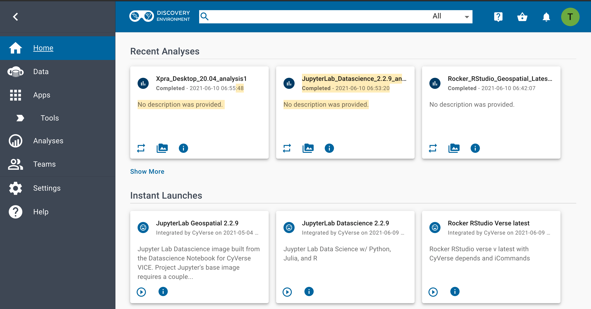
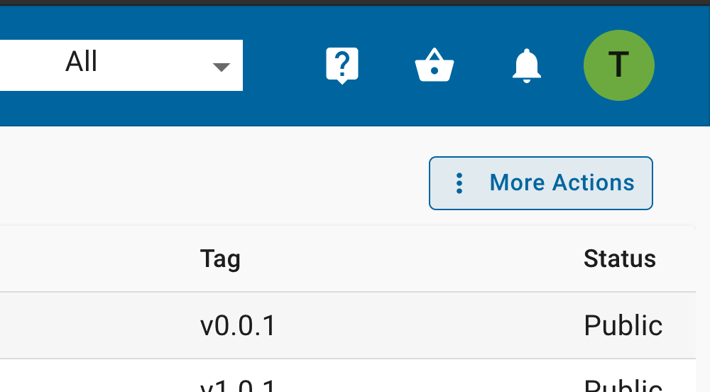
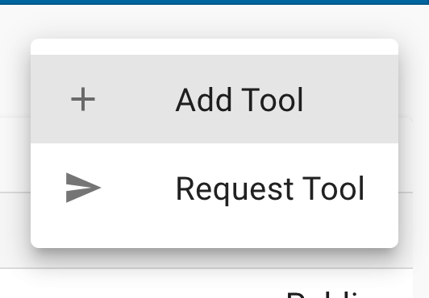
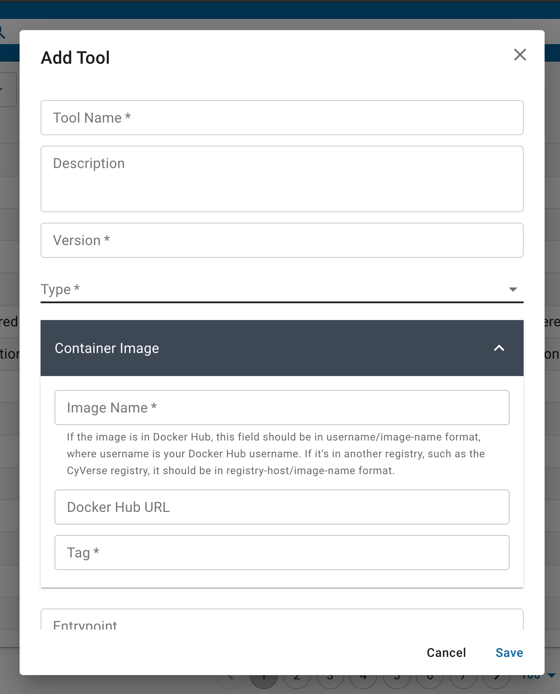
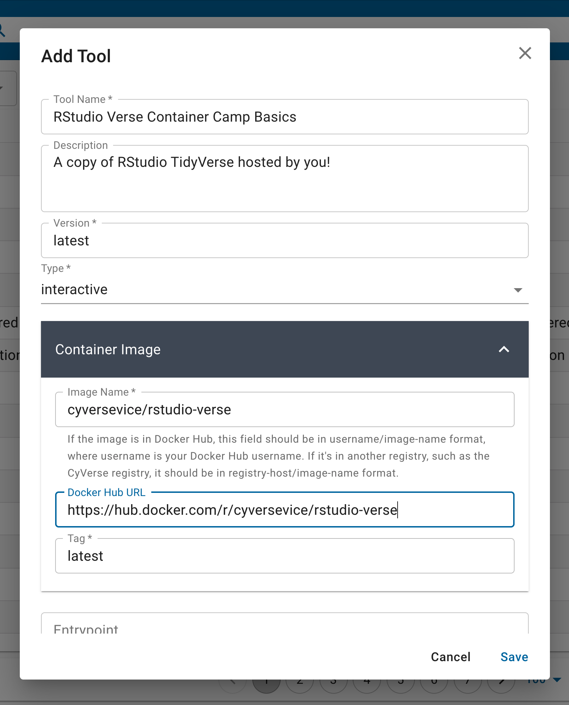
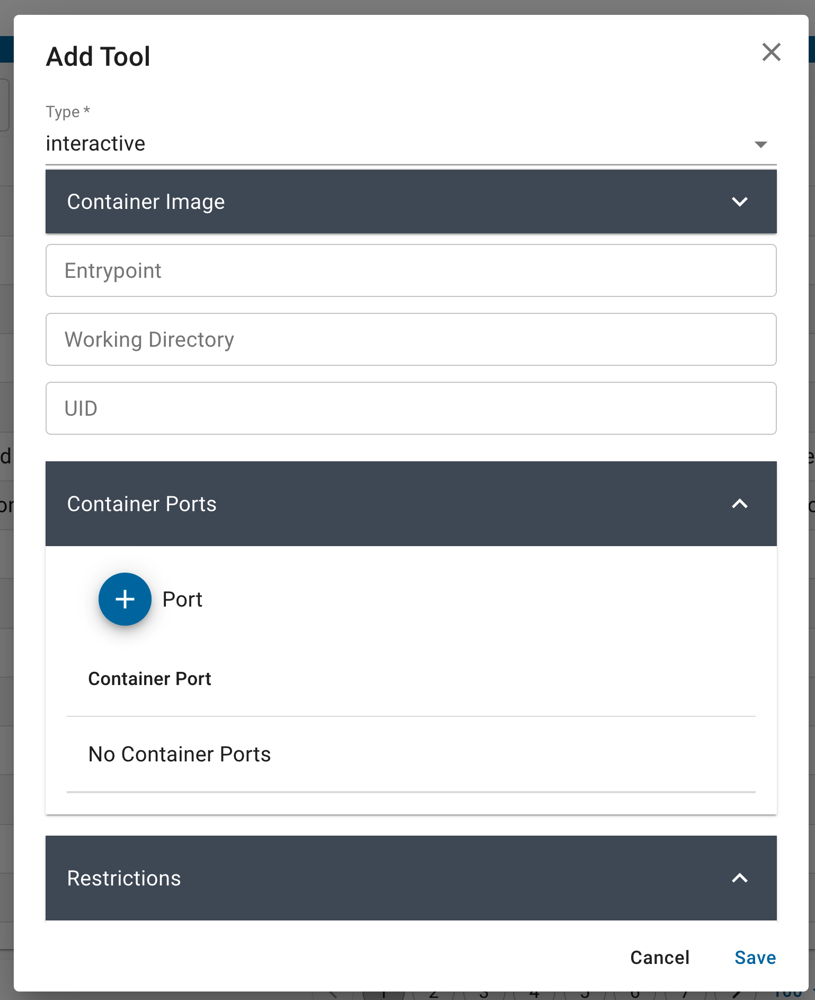
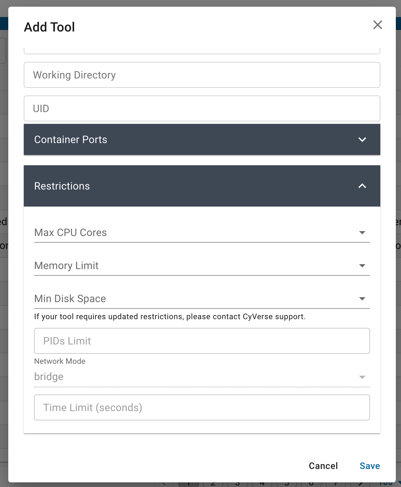

.. include:: ../cyverse_rst_defined_substitutions.txt

|CyVerse_logo2|_

|Home_Icon|_ `Learning Center Home <http://learning.cyverse.org/>`_

**Tool integration in the Discovery Environment (DE)**
======================================================

**Why use the DE?**
-------------------

- Use hundreds of bioinformatics Apps without the command line (or with, if you prefer)
- Batch and interactive modes
- Seamlessly integrated with data and high performance computing – not dependent on your hardware
- Create and publish Apps and workflows so anyone can use them
- Analysis history and provenance – “avoid forensic bioinformatics”
- Securely and easily manage, share, and publish data

**Types of apps**
-----------------

**CyVerse tool:** Software program that is integrated into the back end of the DE for use in DE apps

**CyVerse app:** graphic interface of a tool made available for use in the DE
 
 - **Executable**: user starts an analysis and when the analysis finishes they can find the output files in their 'Analyses' folder

    - **DE**: run locally on our cluster
    - **HPC**: labeled as 'Agave' in the DE. Run on XSEDE resources at Texas Advanced Computing Center (TACC)
    - **OSG**: run on the Open Science Grid

 - **Interactive**: also called Visual and Interactive Computing Environment (VICE). Allows users to open Integrated Development Environments (IDEs) including RStudio, Project Jupyter and RShiny and work interactively within them.

The (containerized) tool must be integrated into the Cyverse DE first. Then an app (interface) can be built for that tool.

**Building an App for Your Tool**
---------------------------------
You can build an app for any tool that:

- is private to you
- is shared with you
- is public

.. Note:: 

    It is a good idea to check to see if the tool you want is already integrated before you start. The tool my be there already and you can build an app using it.

In the hamburger menu on the left side, open the 'Apps' then 'Tools' 

|detool1|

In the Apps window, on the upper right select the 'More Actions' option. 

|detool2|

Then select the 'Add Tool' option. This will open the Tool integration feature. 

|detool3|

Tools are essentially Docker images which are hosted on the internet from public registries like the DockerHub, Quay.io, Biocontainers, etc.

|detool4|

You can populate the Tool fields with the information about your container, and whether it is an 'executable' 'interactive' or 'osg' type application. Executable tools/apps are containers that typically are run from the command line interface. Interactive tools/apps include anything with a graphic user interface (GUI) or integrated development environment (IDE). 'osg' tools/apps are run on the OpenScienceGrid high throughput computing framework.

|detool5|

Each tool requires that you give it a 'Name' and 'Version' -- these are specific to the Discovery Environment search feature and will be used when you design your 'App' interface. 

The 'Container Image' is the Docker image from a public registry. You select an 'Image Name' using the `registry/repository/container` - note: the `Tag` is entered below. Optionally, you can provide a link to the public registry URL.

|detool6|

The new container can be provided with or without an 'Entrypoint', 'Working Directory', and 'UID. You can update or modify the Container Image by updating these in the fields provided, these will overwrite whatever is in the base image.

If your container runs on open ports, e.g., interactive GUI like RStudio and Jupyter run on ports `8787` or `8888` - these must be provided in the 'Container Ports' field.

|detool7|

You can also set the maximum size limitations for your app. These are typically useful for containers that are used for teaching and may not need larger resources. You can leave these fields empty by default.

Once you're sure that you've set these features correctly, click 'Save' and exit the screen.

Your next step is to create a new 'App' interface.

Additional resources
--------------------

 - `DE Guide <https://learning.cyverse.org/projects/discovery-environment-guide/en/latest/>`_
 - `DE Manual <https://wiki.cyverse.org/wiki/display/DEmanual/Table+of+Contents>`_
 - `VICE Manual <https://learning.cyverse.org/projects/vice/en/latest/>`_
 - `Using CyVerse for a shared project <https://learning.cyverse.org/projects/cyverse-group-project-quickstart/en/latest/index.html?highlight=group%20project>`_

----

**Fix or improve this documentation:**

- On Github: |Github Repo Link|
- Send feedback: `Tutorials@CyVerse.org <Tutorials@CyVerse.org>`_

----

.. Comment: Place URLS Below This Line

   .. |Substitution| raw:: html # Place this anywhere in the text you want a hyperlink

      <a href="REPLACE_THIS_WITH_URL" target="blank">Replace_with_text</a>

.. |Toolintegration| raw:: html

    <a href="https://cyverse-de-tool-integration-quickstart.readthedocs-hosted.com/en/latest/index.html" target="blank">Tool Integration into the DE</a>

.. |Github Repo Link|  raw:: html

   <a href="https://github.com/CyVerse-learning-materials/container-camp/blob/main/cyverse/tool_integration_app_building_DE.rst" target="blank">Github Repo Link</a>

  
  

  
  

  
  

  
  

  
  

  
.. |CyVerse_logo2| image:: ../img/cyverse_learning.png
    :width: 500
.. _CyVerse_logo2: http://learning.cyverse.org/

.. |Home_Icon| image:: ../img/homeicon.png
    :width: 25
    :height: 25

.. _Home_Icon: http://learning.cyverse.org/
