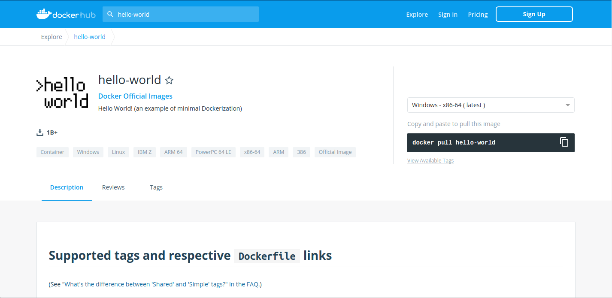
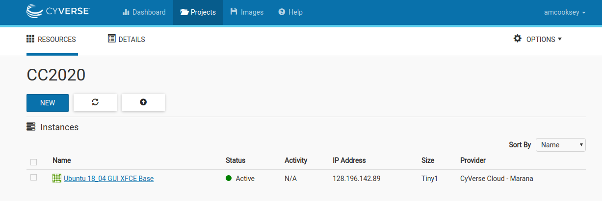
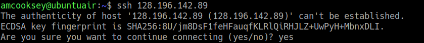
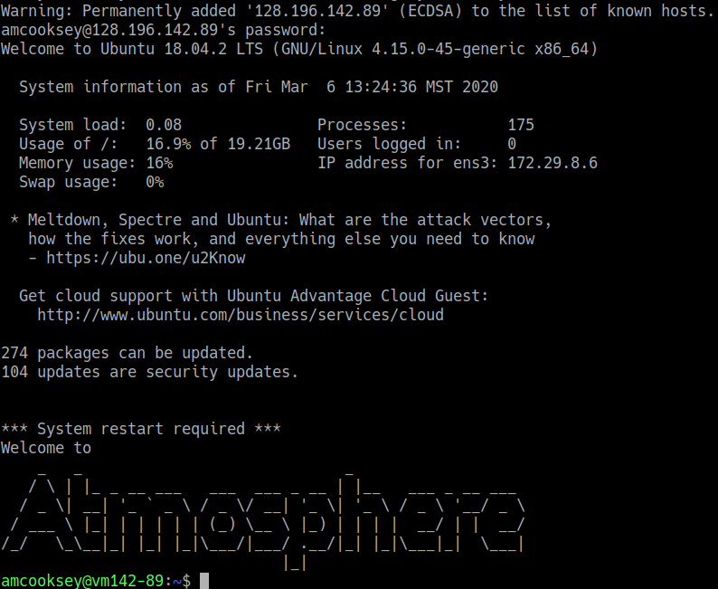

.. include:: ../cyverse_rst_defined_substitutions.txt

|CyVerse_logo2|_

|Home_Icon|_ `Learning Center Home <http://learning.cyverse.org/>`_

**Finding the perfect container** 
============================

Chances are a Docker *image* already exists for the application you use in your research. Rather than starting from scratch and creating your own *image*, you need to know where to look for existing images. 

.. Important::

	But wait, what are the differences in a *container* and an *image*? An important distinction must be made with regard to *base images* and *child images*, *official images* and *user images* 

	**container** - Running instance of an *image* — the *container* runs the actual processes. A container includes an application and all of its dependencies. It shares its kernel with other containers, and runs as an isolated process in the space on the host OS. 

	**layer** - an intermediate image, the result of a single set of build commands. A Docker image is built from layers.
	
	**image** - The file system and configuration of an application which is used to create the container. 
	
	**tag** - identifies exact version of the image. If a tag is not given, by default the ``:latest`` tag will be used.
	
	**base image** - have no parent image, usually images with an OS like ubuntu, alpine or debian.

	**child image** - build on base images, added layers with additional functionality.

	**official image** - Sanctioned images. Docker, Inc. sponsors a dedicated team that is responsible for reviewing and publishing all Official Repositories content. This team works in collaboration with upstream software maintainers, security experts, and the broader Docker community. These are not prefixed by an organization or user name. In the Docker Hub the ``python``, ``node``, ``alpine``, and ``nginx`` images are official (base) images. To find out more about them, check out the `Official Docker Images Documentation <https://docs.docker.com/docker-hub/official_images/>`_.
    
    	**publisher image:** - Certified images that also include support and guarantee compatibility with Docker Enterprise.
    
	**user image** - are images created and shared by users like you. They build on base images and add additional functionality. Typically these are formatted as ``user/image-name``. The user value in the image name is your Dockerhub user or organization name.

	**Dockerfile** - is a text file that contains a list of commands that the Docker daemon calls while creating an image. The Dockerfile contains all the information that Docker needs to know to run the app — a base Docker image to run from, location of your project code, any dependencies it has, and what commands to run at start-up. It is a simple way to automate the image creation process. The best part is that the commands you write in a Dockerfile are almost identical to their equivalent Linux commands. This means you don't really have to learn new syntax to create your own Dockerfiles.
	

Docker Registries
~~~~~~~~~~~~~~~~

Docker uses the concept of "*Registries*" 

.. admonition:: Question

    What *EXACTLY* is a **Registry**? 

       .. admonition:: Answer
            
            a storage and distribution system for named Docker images
            
            Organized by owners into "repositories" with compiled "*images*" that users can download and run 
            
Things you can do with Docker registries:

    - Search for public images
    - Pull images
    - Share private images
    - Push images 

    * You must have an account on a registry to create repositories and images.

    * You can create many repositories. 

    * You can create many tagged images in a repository

    * You can even set up your own private registry using a *Docker Trusted Registry*

**Search image registries**
~~~~~~~~~~~~~~~~~~~~~~~~~~~

.. Warning:: 

    Only use images from trusted sources or images for which you can see the ``Dockerfile``. Any image from an untrusted source could contain something other than what's indicated. If you can see the Dockerfile you can see exactly what is in the image.

The Docker command line interface uses the `Docker Hub <https://hub.docker.com/>`_ public registry by default. 

Some examples of public/private registries to consider for your research needs:

- `Docker Hub <https://hub.docker.com/>`_ 
- `Docker Trusted Registry <https://docs.docker.com/ee/dtr/>`_
- `Amazon Elastic Container Registry <https://aws.amazon.com/ecr/>`_
- `Google Container Registry <https://cloud.google.com/container-registry/docs>`_
- `Azure Container Registry <https://azure.microsoft.com/en-us/services/container-registry/>`_
- `NVIDIA GPU Cloud <https://ngc.nvidia.com/catalog/containers>`_
- `Private Docker Registry <https://private-docker-registry.com/>`_ - not official Docker
- `Gitlab Container Registry <https://docs.gitlab.com/ce/administration/container_registry.html>`_
- `Quay <https://quay.io/>`_
- `TreeScale <https://treescale.com/>`_
- `Canister <https://www.canister.io/>`_
- `BioContainers Registry <https://biocontainers.pro/#/registry>`_

|dockerhub|
-------------

Docker Hub is a service provided by Docker for finding and sharing container images with your team. Docker Hub is the most well-known and popular image registry for Docker containers.

.. Important::

	**Registry**  a storage and distribution system for named Docker images

	**Repository** collection of "images" with individual "tags".
    
   	**Teams & Organizations:** Manages access to private repositories.

	**Builds:** Automatically build container images from GitHub or Bitbucket on the Docker Hub.
    
    	**Webhooks:** Trigger actions after a successful push to a repository to integrate Docker Hub with other services.

|biocontainerlogo|

|biocontainerreg|
------------------

BioContainers is a community-driven project that provides the infrastructure and basic guidelines to create, manage and distribute bioinformatics containers with **special focus in proteomics, genomics, transcriptomics and metabolomics**. BioContainers is based on the popular frameworks of Docker.

Although anyone can create a BioContainer, the majority of BioContainers are created by the Bioconda project. Every Bioconda package has a corresponding BioContainer available at Quay.io.

|quayio|
---------
Quay is another general image registry. It works the same way as Docker Hub. However, Quay is home to all BioContainers made by the Bioconda project. Now we will find a BioContainer image at Quay, pull that image and run it on cloud virtual machine.

NVIDIA GPU Cloud
----------------

NVIDIA is one of the leading makers of graphic processing units (GPU). GPU were established as a means of handling graphics processing operations for video cards, but have been greatly expanded for use in generalized computing applications, Machine Learning, image processing, and matrix-based linear algebras.

|NVIDIA-docker-diagram|

NVIDIA have created their own set of Docker containers and Registries for running on CPU-GPU enabled systems.

`NVIDIA-Docker <xhttps://github.com/NVIDIA/nvidia-docker>`_ runs atop the NVIDIA graphics drivers on the host system, the NVIDIA drivers are imported to the container at runtime.

`NVIDIA Docker Hub <https://hub.docker.com/u/nvidia>`_ hosts numerous NVIDIA Docker containers, from which you can build your own images.

`NVIDIA GPU Cloud <https://ngc.nvidia.com>`_ hosts numerous containers for HPC and Cloud applications. You must register an account with them (free) to access these. 

NVIDIA GPU Cloud hosts three `registry spaces <https://docs.nvidia.com/ngc/ngc-user-guide/ngc-spaces.html#ngc-spaces>`_

  * `nvcr.io/nvidia` - catalog of fully integrated and optimized deep learning framework containers.
  * `nvcr.io/nvidia-hpcvis` - catalog of HPC visualization containers (beta).
  * `nvcr.io/hpc` -  popular third-party GPU ready HPC application containers.

NVIDIA Docker can be used as a base-image to create containers running graphical applications remotely. High resolution 3D screens are piped to a remote desktop platform.

Programs which leverage 3D applications include `VirtualGL <https://www.virtualgl.org/>`_, `TurboVNC <https://www.turbovnc.org/>`_, & `TigerVNC <https://tigervnc.org/>`_.

An example application of a graphics-enabled remote desktop is the use of `Blender <https://www.blender.org/>`_ for creating high level of detail images or animations.

**Pull an image from a registry**
----------------------------------

To run your container you will need a computer with Docker installed. 
We will use an Atmosphere cloud instance today but this can be done on any computer.

Open an Atmosphere instance
^^^^^^^^^^^^^^^^^^^^^^^^^^^^

1. Go to `Atmosphere <https://atmo.cyverse.org/>`_ and log in with your CyVerse credentials.
 
2. Click on 'projects' tab at the top of the page.

3. You should have a project called 'Conatainer Camp 2020'; click on that tile.

4. You should already have a running instance called **Ubuntu 18_04 GUI XFCE Base**. To confirm this look for a green dot and the word 'Active' under 'status'.

 |atmoactive|

5. Copy the IP address for your instance

6. Open a terminal on your computer

7. Connect to your Atmoshere instance via ssh **using the IP address you copied**

.. code-block:: bash

    $ ssh 128.196.142.89

8. You will be asked if you are sure you want to continue--say **yes**.

   |atmoauth|

9. If you see something like this (below) then you have successfully logged into your Atmophere instance.

   |atmosuccess|
 
Install Docker
^^^^^^^^^^^^^^^^^^^^^

Installing Docker on your computer takes a little time but it is reasonably straight forward and it is a one-time setup. |How to install Docker|. 

Docker installation is much easier on an Atmosphere instance with the 'ezd' command.

.. code-block:: bash

    $ ezd
    
Use 'docker pull' to get the image
^^^^^^^^^^^^^^^^^^^^^^^^^^^^^^^^^^

Go to |dockerhub| and search for 'hello-world' in the search bar at the top of the page. 

|hubfind1|

Click on the 'tag' tab to see all the available 'hello-world' images. 

Click the 'copy' icon at the right to copy the docker pull command that we will need on the command line.

Now you will need to pull the image from the registry onto your computer. Use the 'docker pull' command you copied from the registry above. 

.. Note:: 
    If you are working on a system for which you don't have root permissions you will need to use 'sudo' and provide your password. Like this:

.. code-block:: bash

   $ sudo docker pull hello-world:latest

Now list the files in your current working directory

.. code-block:: bash

   $ ls -l

Where is the image you just pulled? 
Docker saves container images to the Docker directory (where Docker is installed). You won't ever see them in your working directory.

Use 'docker images' to see all the images on your computer:

.. code-block:: bash

   $ sudo docker images

----

**Fix or improve this documentation:**

- On Github: |Github Repo Link|
- Send feedback: `Tutorials@CyVerse.org <Tutorials@CyVerse.org>`_

----

.. |CyVerse_logo2| image:: ../img/cyverse_learning.png
    :width: 500
.. _CyVerse_logo2: http://learning.cyverse.org/

.. _CyVerse_logo: https://cyverse.org

.. |Home_Icon| image:: ../img/homeicon.png
    :width: 25
    :height: 25

.. _Home_Icon: http://learning.cyverse.org/

.. |Github Repo Link|  raw:: html

   <a href="https://github.com/CyVerse-learning-materials/foss-2019/tree/master/Containers/biocontainers.rst" target="blank">Github Repo Link</a>

.. |dockerdocs|  raw:: html

   <a href="https://docs.docker.com" target="blank">Docker</a>

.. |dockerhub|  raw:: html

   <a href="https://hub.docker.com" target="blank">Docker Hub</a>

.. |quayio|  raw:: html

   <a href="https://quay.io/" target="blank">Quay</a>

.. |biocontainerreg|  raw:: html

   <a href="https://biocontainers.pro/#/registry" target="blank">BioContainers Registry</a>

.. |How to install Docker|  raw:: html

   <a href="https://learning.cyverse.org/projects/container_camp_workshop_2019/en/latest/docker/dockerintro.html" target="blank">How to install Docker</a>

.. |linuxdocker|  raw:: html

   <a href="https://docs.docker.com/install/linux/docker-ce/ubuntu" target="blank">Linux platforms</a>

.. |builddocker|  raw:: html

   <a href="https://cyverse-creating-docker-containers-quickstart.readthedocs-hosted.com/en/latest/step3.html" target="blank">More information on building Docker images</a>

.. |macdocker|  raw:: html

   <a href="https://docs.docker.com/docker-for-mac/install" target="blank">Mac</a>

.. |windowsdocker|  raw:: html

   <a href="https://docs.docker.com/docker-for-windows/install" target="blank">Windows</a>
   
.. |docker| image:: ../img/docker.png
  :width: 250

.. |biocontainerlogo| image:: ../img/biocontainers5a.png
  :width: 300

.. |NVIDIA-docker-diagram| image:: https://cloud.githubusercontent.com/assets/3028125/12213714/5b208976-b632-11e5-8406-38d379ec46aa.png  
    :width: 800
