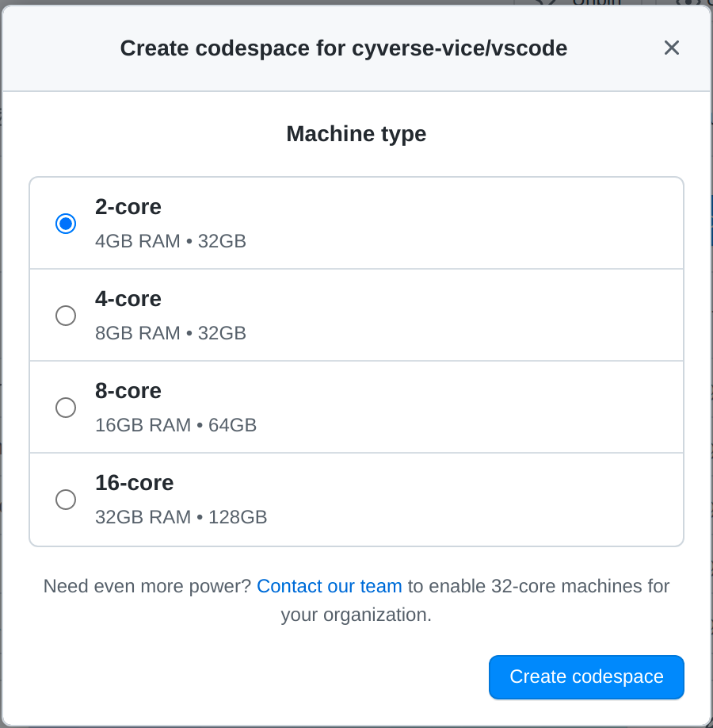
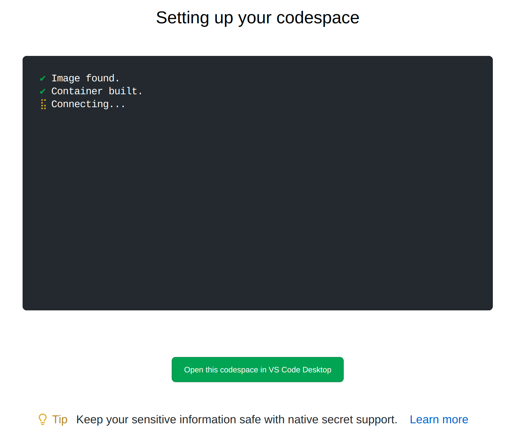

# GitHub CodeSpaces

For this workshop, we are working in GitHub [CodeSpaces](https://docs.github.com/en/codespaces){target=_blank}. You will be given access to an organization where CodeSpaces have been enabled or the workshop. 

??? Question "What is a 'Development Environment'?"

    A development environment or `Dev Env` for short, is a place where software can be written and tested without impacting users or "production" environments.
    
    Containers-within-containers is another way to think about this paradigm -- we can create a containerized Integrated Development Environment (IDE) container which has all of our favorite software tools and visual software.
    
    **Terminology:**
    
    *Development Environment*: Environment for development tasks such as designing, programming, debugging, etc.

    *Test Environment*: an environment with the same configuration as the "production environment" where testing can be done without interrupting the main service, also called Q/A or Quality Assurance Environment. 
    
    *Staging Environment*: Where the work from testing is merged into the built system before release. 
    
    *Production Environment*: The environment where users interact with the now-public tools. 
    
"CodeSpaces" are virtual services which provides "cloud-based development environment" for software programmers and data scientists. 

GitHub's CodeSpace is run on cloud services (Microsoft Azure), and links with your GitHub account for a seamless experience working on code in a Git repository.

??? Question "How can you get your own educational GitHub & CodeSpaces?"

    You can gain access to discounted GitHub CodeSpaces by enrolling your GitHub account with [GitHub Education](https://education.github.com/){target=_blank} and then applying the [educator discount](https://education.github.com/discount_requests/teacher_application){target=_blank} to your organizations and repos.
    
    Not interested in using GitHub based dev environments? Check out [GitPod](https://www.gitpod.io/){target=_blank} or [GitLub Education](https://about.gitlab.com/solutions/education/){target=_blank} and [Developer Environments](https://docs.gitlab.com/runner/development/){target=_blank}

## Starting a CodeSpace

When a GitHub Organization and Repository have CodeSpaces enabled you will see a "Code" button above the README.md

{width="300"}

Click on the "Code" button and start a new CodeSpace

{width="300"}

Select the size of the CodeSpace you want (2-4 cores and 4GB to 8GB of RAM should be plenty for today)

{width="300"}

Click "Create CodeSpace"

You will be taken to a loading screen, and after a few moments (<2 minutes) your browser will change to a VS Code instance in your browser.

{width="500"}

Notice, the GitHub repository where you initiated the CodeSpace is set as the working directory of the EXPLORER :material-file-document-multiple: in the upper left side of VS Code interface. You're in your Git repo, and are able to work with Python, Docker, Node, or any one of many featured developer tools. Further, you can install any tools you like!

{width="600"}
