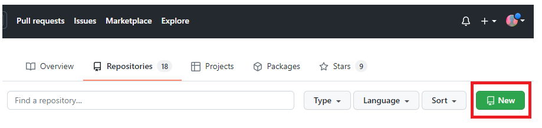
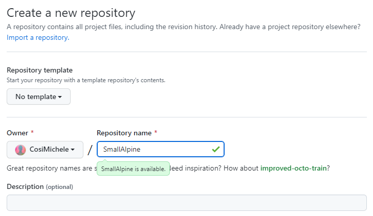
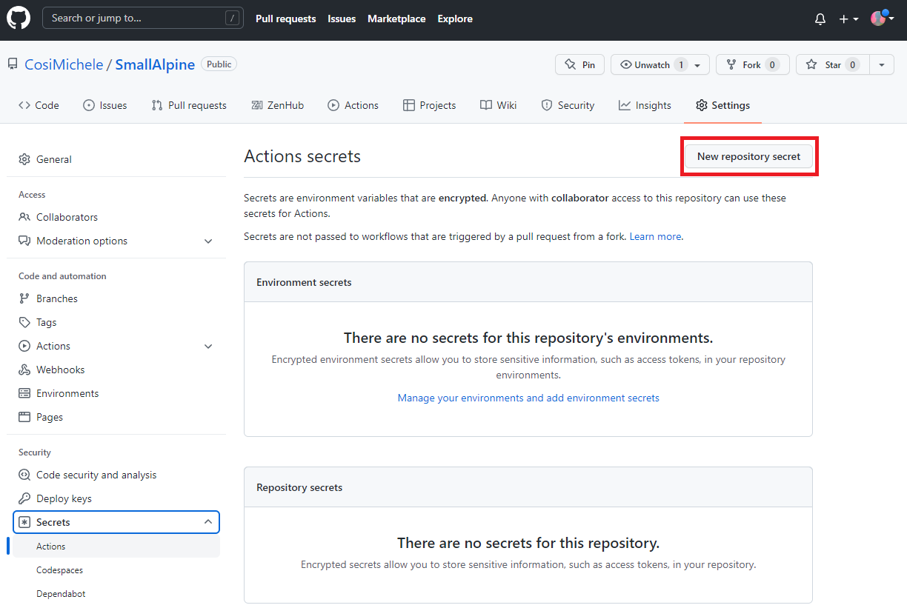
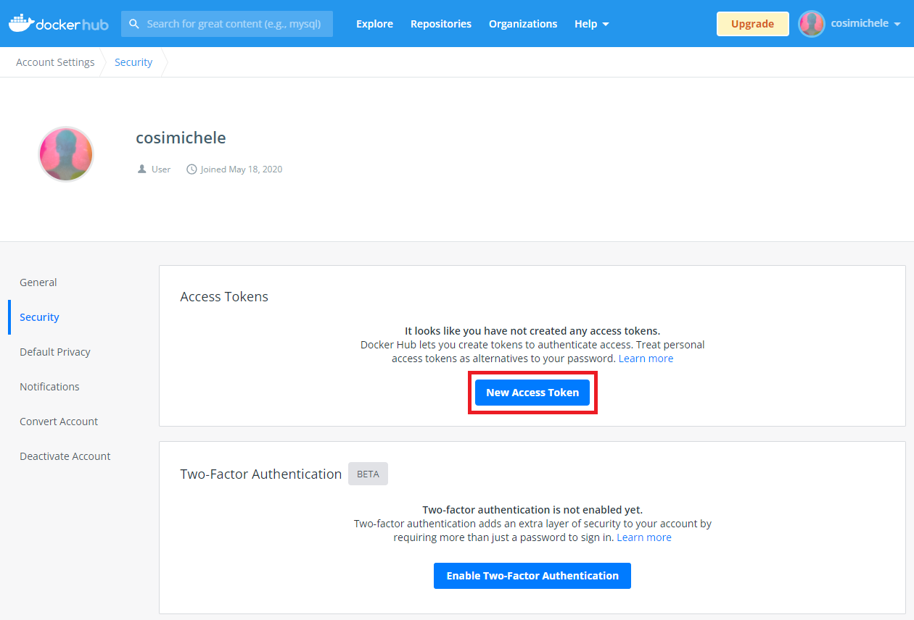
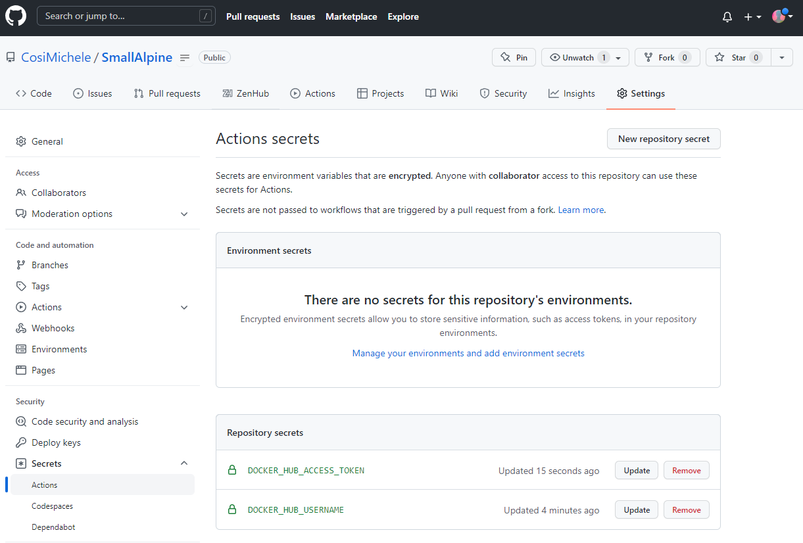
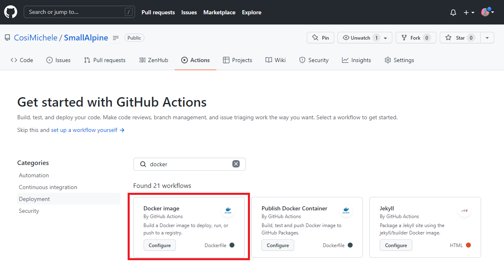
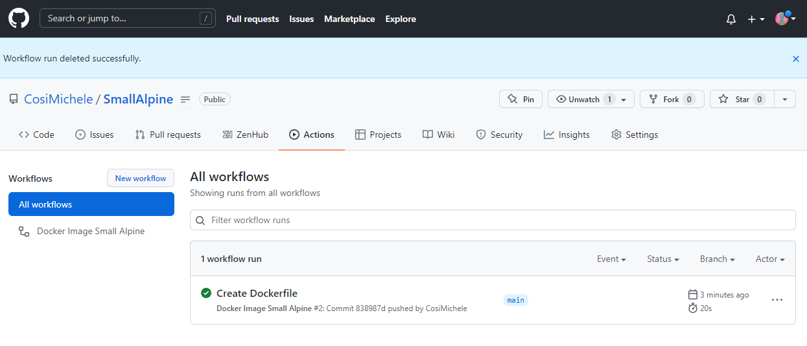
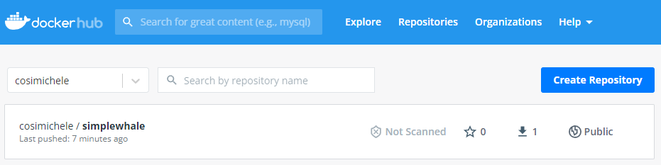
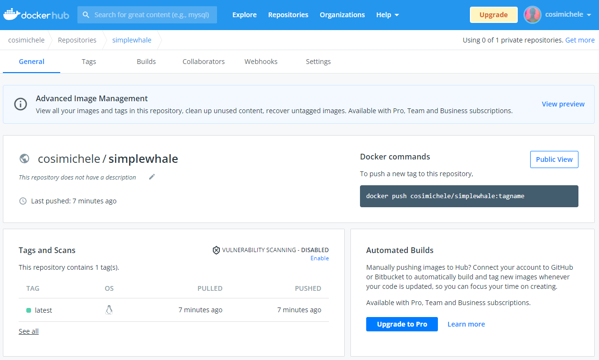

# GitHub Actions and Docker

**Actions** is a feature of [GitHub](https://github.com/) that allows the automation and execution of workflows invoved in the development of your software and code. Read more on GitHub Actions at the [offical GitHub Docs page](https://docs.github.com/en/actions/learn-github-actions/understanding-github-actions).

GitHub Actions can also be used to create and manage your own Docker Images and Containers. Here we will learn how we can create a Docker Imange through GitHub Actions.

In this example we are going to creat a small GitHub repository that will create and push your Docker Image.

---

## Setting up a Docker Project

A Docker project on GitHub requires 2 folders:

- A `.github/workflows` folder: containing required necessary `yml` files that build the containers through GitHub;
- A `Dockerfile`: file necessary to build containers.

### Prerequisites

- A [GitHub](https://github.com/) account;
- A [Docker](https://www.docker.com/) account.

### Creating your Docker Repository on GitHub

To create a GitHub Repository:
1. Navigate to your GitHub Account and select **New**;



2\. Give your repository a unique name;

??? Tip
    It is also suggested to add `README` file as this will add structure to the repository



3\. Click **Create Repository**.

Navigate to your new Repository. Either `clone` your repository to your own machine (suggested), or work directly within GitHub.

### Linking your GitHub and Docker accounts

Ensure you can access [Docker Hub](https://hub.docker.com/) from any workflows you create:

1. Add your Docker ID as a secret to GitHub. Navigate to your GitHub repository and click **Settings > Secrets > New secret**.



2\. Create a new secret with the name `DOCKER_HUB_USERNAME` and your Docker ID as value.
3\. On DockerHub, create a new Personal Access Token (PAT). To create a new token, go to [Docker Hub Settings](https://hub.docker.com/settings/security) and then click **New Access Token**. Name it, and copy the newly generated PAT.

??? Tip
    Name your Docker Hub Access token the same name as your GitHub repository, it will help with keeping track which GitHub repository is related to which Docker image.




4. On GitHub, return to your repository secrets, and add the PAT as a secret with the name `DOCKER_HUB_ACCESS_TOKEN`.



---

## Setting up a GitHub Action Workflow

Now that you have connected your GitHub repository with your Docker account, you are ready to add the necessary files to your repo.

!!! Note
        In this example, we will use the existing Docker image Alpine.

1\. In your GitHub repository, create a file and name in `Dockerfile`; In the first line of your `Dockerfile` paste:

```
FROM alpine:3.14
```

2\. Click the `Actions` tab and in the search bar, search for `docker`. Select the `docker image workflow` (as shown in the image below)

!!! Note
        This will create the `.github/workflows` repository and necessary `yml` file required for the GitHub actions.



3\. You will be prompted to the `docker-image.yml` file; paste the following code, and `commit` your changes.

```
name: Docker Image Small Alpine

on:
  push:
    branches: [ main ]
  pull_request:
    branches: [ main ]

jobs:

  build:

    runs-on: ubuntu-latest

    steps:
      -
        name: Checkout 
        uses: actions/checkout@v2
      -
        name: Login to Docker Hub
        uses: docker/login-action@v1
        with:
          username: ${{ secrets.DOCKER_HUB_USERNAME }}
          password: ${{ secrets.DOCKER_HUB_ACCESS_TOKEN }}
      -
        name: Build and push
        uses: docker/build-push-action@v2
        with:
          context: .
          file: ./Dockerfile
          push: true
          tags: ${{ secrets.DOCKER_HUB_USERNAME }}/simplewhale:latest
```
4\. Upon committing and pushing your changes, you can check your Workflows under the Actions tab on GitHub.

!!! Note
        Github will show you when a workflow is building:
        - An orange dot next to your commit count means that the workflow is running;
        - A crossed red circle means that your workflow has failed;
        - A green check means your workflow ran successfully.



5\. Navigate to your Docker Hub to see your GitHub Actions generated Docker image.





---

## Optimizing the workflow

!!! Note
    This will work only work after you have pushed your Docker changes at least once.

You can optimize your workflow by using **build cache**, reducing the time required to build large images.

To use cache for optimization, add the following lines to your `docker-image.yml`:

```
          cache-from: type=registry,ref=${{ secrets.DOCKER_HUB_USERNAME }}/simplewhale:buildcache
          cache-to: type=registry,ref=${{ secrets.DOCKER_HUB_USERNAME }}/simplewhale:buildcache,mode=max
```

Your file will look as following:

```
name: Docker Image Small Alpine

on:
  push:
    branches: [ main ]
  pull_request:
    branches: [ main ]

jobs:

  build:

    runs-on: ubuntu-latest

    steps:
      -
        name: Checkout 
        uses: actions/checkout@v2
      -
        name: Login to Docker Hub
        uses: docker/login-action@v1
        with:
          username: ${{ secrets.DOCKER_HUB_USERNAME }}
          password: ${{ secrets.DOCKER_HUB_ACCESS_TOKEN }}
      -
        name: Build and push
        uses: docker/build-push-action@v2
        with:
          context: .
          file: ./Dockerfile
          push: true
          tags: ${{ secrets.DOCKER_HUB_USERNAME }}/simplewhale:latest
          cache-from: type=registry,ref=${{ secrets.DOCKER_HUB_USERNAME }}/simplewhale:buildcache
          cache-to: type=registry,ref=${{ secrets.DOCKER_HUB_USERNAME }}/simplewhale:buildcache,mode=max
```

!!! Warning: Attention!
    When attemtping to build your future containers, replace the ending of the additional lines with the correct name of the Docker image as it appears on Docker Hub (in this example, `simplewhale` is the name of our image):

    ```
              cache-from: type=registry,ref=${{ secrets.DOCKER_HUB_USERNAME }}/<DOCKER-HUB-IMAGE-NAME>:buildcache
              cache-to: type=registry,ref=${{ secrets.DOCKER_HUB_USERNAME }}/<DOCKER-HUB-IMAGE-NAME>:buildcache,mode=max
    ```