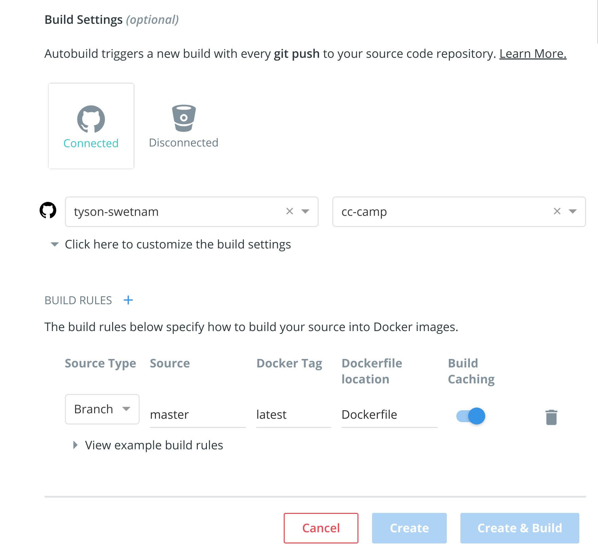
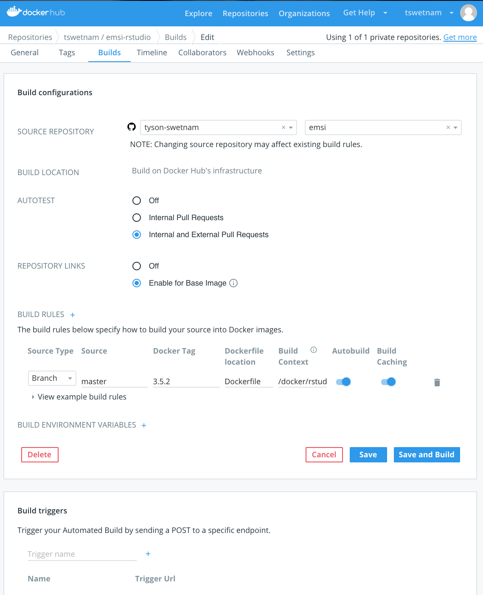
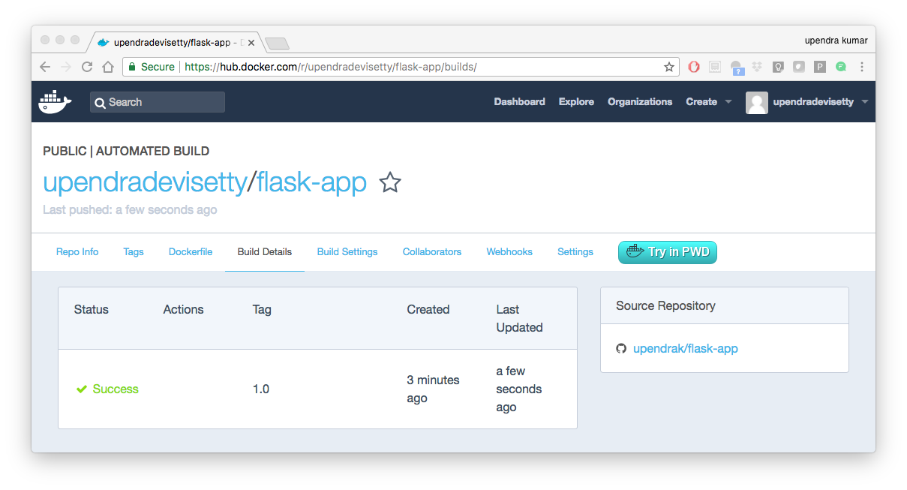

# Advanced Docker

## Automated Docker image building from GitHub

An automated build is a Docker image build that is triggered by a code
change in a GitHub or Bitbucket repository. By linking a remote code
repository to a Dockerhub automated build repository, you can build a
new Docker image every time a code change is pushed to your code
repository.

A build context is a Dockerfile and any files at a specific location.
For an automated build, the build context is a repository containing a
Dockerfile.

Automated Builds have several advantages:

-   Images built in this way are built exactly as specified.
-   The Dockerfile is available to anyone with access to your Docker Hub
    repository.
-   Your repository is kept up-to-date with code changes automatically.
-   Automated Builds are supported for both public and private
    repositories on both GitHub and Bitbucket.

### Prerequisites

To use automated builds, you first must have an account on [Docker
Hub](https://hub.docker.com) and on the hosted repository provider
([GitHub](https://github.com/) or [Bitbucket](https://bitbucket.org/)).
While Docker Hub supports linking both GitHub and Bitbucket
repositories, here we will use a GitHub repository. If you don\'t
already have one, make sure you have a GitHub account. A basic account
is free

!!! Note
        -   If you have previously linked your Github or Bitbucket account, you
            must have chosen the Public and Private connection type. To view
            your current connection settings, log in to Docker Hub and choose
            Profile > Settings > Linked Accounts & Services.
        -   Building Windows containers is not supported.


### Link your Docker Hub account to GitHub

1.  Log into Docker Hub.
2.  Click "Create Repository+"


3\.  Click the Build Settings and select `GitHub`.


The system prompts you to choose between **Public and Private** and
**Limited Access**. The **Public** and **Private** connection type is
required if you want to use the Automated Builds.

4\.  Press `Select` under **Public and Private** connection type. If you
    are not logged into GitHub, the system prompts you to enter GitHub
    credentials before prompting you to grant access. After you grant
    access to your code repository, the system returns you to Docker Hub
    and the link is complete.



After you grant access to your code repository, the system returns you
to Docker Hub and the link is complete. For example, github linked
hosted repository looks like this:


### Automated Container Builds

Automated build repositories rely on the integration with a version
control system (GitHub or Gitlab) where your `Dockerfile` is kept.

Let's create an automatic build for our container using the
instructions below:

1.  Initialize git repository for the [mynotebook]{.title-ref} directory
    you created for your `Dockerfile`

``` bash
$ git init
Initialized empty Git repository in /home/julianp/mynotebook/.git/

$ git status
On branch master

Initial commit

Untracked files:
(use "git add <file>..." to include in what will be committed)

    Dockerfile
    model.py

nothing added to commit but untracked files present (use "git add" to track)

$ git add * && git commit -m "Add files and folders"
[master (root-commit) a4f732a] Add files and folders
 2 files changed, 10 insertions(+)
 create mode 100644 Dockerfile
 create mode 100644 model.py
```

2\.  Create a new repository on github by navigating to this URL -
    <https://github.com/new>


!!! Note
        Don't initialize the repository with a README and don\'t add a license.


3\.  Push the repository to github

``` bash
$ git remote add origin https://github.com/<your-github-username>/mynotebook.git

$ git push -u origin master
Counting objects: 7, done.
Delta compression using up to 8 threads.
Compressing objects: 100% (5/5), done.
Writing objects: 100% (7/7), 1.44 KiB | 0 bytes/s, done.
Total 7 (delta 0), reused 0 (delta 0)
To https://github.com/<your-github-username>/mynotebook.git
 * [new branch]      master -> master
Branch master set up to track remote branch master from origin.
```

4\.  Select `Create` > `Create Automated Build` from Docker Hub.

-   The system prompts you with a list of User/Organizations and code
    repositories.
-   For now select your GitHub account from the User/Organizations list
    on the left. The list of repositories change.
-   Pick the project to build. In this case `mynotebook`. Type in
    \"Jupyter Test\" in the Short Description box.
-   If you have a long list of repos, use the filter box above the list
    to restrict the list. After you select the project, the system
    displays the Create Automated Build dialog.



!!! Note
        The dialog assumes some defaults which you can customize. By default,
        Docker builds images for each branch in your repository. It assumes the
        Dockerfile lives at the root of your source. When it builds an image,
        Docker tags it with the branch name.

5\.  Customize the automated build by pressing the
    `Click here to customize` behavior link.


Specify which code branches or tags to build from. You can build by a
code branch or by an image tag. You can enter a specific value or use a
regex to select multiple values. To see examples of regex, press the
Show More link on the right of the page.

-   Enter the `master` (default) for the name of the branch.
-   Leave the Dockerfile location as is.
-   Recall the file is in the root of your code repository.
-   Specify `1.0` for the Tag Name.

6\.  Click `Create`.

!!! Warning "Important"
        During the build process, Docker copies the contents of your Dockerfile
        to Docker Hub. The Docker community (for public repositories) or
        approved team members/orgs (for private repositories) can then view the
        Dockerfile on your repository page.

        The build process looks for a README.md in the same directory as your
        Dockerfile. If you have a README.md file in your repository, it is used
        in the repository as the full description. If you change the full
        description after a build, it's overwritten the next time the Automated
        Build runs. To make changes, modify the README.md in your Git
        repository.

!!! Warning
        You can only trigger one build at a time and no more than one every five
        minutes. If you already have a build pending, or if you recently
        submitted a build request, Docker ignores new requests.

It can take a few minutes for your automated build job to be created.
When the system is finished, it places you in the detail page for your
Automated Build repository.

7\.  Manually Trigger a Build

Before you trigger an automated build by pushing to your GitHub
`mynotebook` repo, you\'ll trigger a manual build. Triggering a manual
build ensures everything is working correctly.

From your automated build page choose `Build Settings`


Press `Trigger` button and finally click `Save Changes`.

!!! Note
        Docker builds everything listed whenever a push is made to the code
        repository. If you specify a particular branch or tag, you can manually
        build that image by pressing the Trigger. If you use a regular
        expression syntax (regex) to define your build branch or tag, Docker
        does not give you the option to manually build.


8\.  Review the build results

The Build Details page shows a log of your build systems:

Navigate to the `Build Details` page.

Wait until your image build is done.

You may have to manually refresh the page and your build may take
several minutes to complete.



### Exercise 1 (5-10 mins): Updating and automated building

-   `git add`, `commit` and `push` to your GitHub or Gitlab repo
-   Trigger automatic build with a new tag (2.0) on Docker Hub
-   Pull your Docker image from Docker Hub to a new location.
-   Run the instance to make sure it works

---

## Volumes Continued

### Bind mounts

When you run a container, you can bring a directory from the host system
into the container, and give it a new name and location using the `-v`
or `--volume` flag.

``` bash
$ mkdir -p ~/local-data-folder
$ echo "some data" >> ~/local-data-folder/data.txt
$ docker run -v ${HOME}/local-data-folder:/data $YOUR_DOCKERHUB_USERNAME/mynotebook:latest cat /data/data.txt
```

In the example above, you can mount a folder from your localhost, in
your home user directory into the container as a new directory named
`/data`.

### Create and manage volumes

Unlike a bind mount, you can create and manage volumes outside the scope
of any container.

A given volume can be mounted into multiple containers simultaneously.
When no running container is using a volume, the volume is still
available to Docker and is not removed automatically. You can remove
unused volumes using `docker volume prune` command.

When you create a Docker volume, it is stored within a directory on the
Docker Linux host (`/var/lib/docker/`).

!!! Note
        File location on Mac OS X is a bit different:
        <https://timonweb.com/posts/getting-path-and-accessing-persistent-volumes-in-docker-for-mac/>

Let's create a volume

``` bash
$ docker volume create my-vol
```

List volumes:

``` bash
$ docker volume ls

local               my-vol
```

Inspect a volume by looking at the Mount section in the `docker volume inspect`

``` bash
$ docker volume inspect my-vol
[
    {
        "Driver": "local",
        "Labels": {},
        "Mountpoint": "/var/lib/docker/volumes/my-vol/_data",
        "Name": "my-vol",
        "Options": {},
        "Scope": "local"
    }
]
```

Remove a volume

``` bash
$ docker volume rm my-vol
$ docker volume ls
```

### Populate a volume using a container

This example starts an `alpine` container and populates the new volume
`output-vol` with the some output created by the container.

``` bash
docker volume create output-vol
docker run --name=data-app --mount source=output-vol,target=/data alpine sh -c 'env >> /data/container-env.txt'
```

Use `docker inspect output-vol` to see where the volume data lives on
your host, and then use `cat` to confirm that it contains the output
created by the container.

``` bash
docker volume inspect output-vol
sudo cat /var/lib/docker/volumes/output-vol/_data/container-env.txt
```

You should see something like:

``` 
HOSTNAME=790e13bba28a
SHLVL=1
HOME=/root
PATH=/usr/local/sbin:/usr/local/bin:/usr/sbin:/usr/bin:/sbin:/bin
PWD=/
```

After running either of these examples, run the following commands to
clean up the container and volume.

``` bash
docker rm data-app
docker volume rm output-vol
```

### Bind mounts

**Bind mounts:** When you use a bind mount, a file or directory on the
host machine is mounted into a container.

??? Tip
        If you are developing new Docker applications, consider using named
        **volumes** instead. You can't use Docker CLI commands to directly
        manage bind mounts.

[bind_mount](../assets/docker/bind_mount.png)

!!! Warning
        One side effect of using bind mounts, for better or for worse, is that
        you can change the host filesystem via processes running in a container,
        including creating, modifying, or deleting important system files or
        directories. This is a powerful ability which can have security
        implications, including impacting non-Docker processes on the host
        system.

        If you use `--mount` to bind-mount a file or directory that does not yet
        exist on the Docker host, Docker does not automatically create it for
        you, but generates an error.

#### Start a container with a bind mount

Create a `bind-data` directory in your home directory.

``` bash
cd ~
mkdir -p ~/bind-data
```

Run a container, mounting this directory inside the container, and the
container should create some data in there.

``` bash
docker run --mount type=bind,source="$(pwd)"/bind-data,target=/data alpine sh -c 'env >> /data/container-env.txt'
```

Check that the output looks right.

``` bash
cat ~/bind-data/container-env.txt
```

#### Use a read-only bind mount

For some development applications, the container needs to write into the
bind mount, so changes are propagated back to the Docker host. At other
times, the container only needs read access.

This example modifies the one above but mounts the directory as a
read-only bind mount, by adding `ro` to the (empty by default) list of
options, after the mount point within the container. Where multiple
options are present, separate them by commas.

``` bash
docker run --mount type=bind,source="$(pwd)"/bind-data,target=/data,readonly alpine sh -c 'ls -al /data/ && env >> /data/container-env.txt'
```

You should see an error message about not being able to write to a
read-only file system.

``` bash
sh: can't create /data/container-env.txt: Read-only file system
```

---

## Docker Compose for multi-container apps

[Docker Compose](https://docs.docker.com/compose/) is a tool for
defining and running multi-container Docker applications. It requires
you to have a `docker-compose.yml` file.

::: note
::: title
Note
:::

Docker for Mac and Docker Toolbox already include Compose along with
other Docker apps, so Mac users do not need to install Compose
separately. Docker for Windows and Docker Toolbox already include
Compose along with other Docker apps, so most Windows users do not need
to install Compose separately.

For Linux users

``` bash
sudo curl -L https://github.com/docker/compose/releases/download/1.25.4/docker-compose-`uname -s`-`uname -m` -o /usr/local/bin/docker-compose

sudo chmod +x /usr/local/bin/docker-compose
```
:::

Main advantages of Docker compose include:

-   Your applications can be defined in a YAML file where all the same
    options required in `docker run` are now defined (reproducibility).
-   It allows you to manage your application(s) as a single entity
    rather than dealing with starting individual containers
    (simplicity).

Let\'s now create a Docker Compose `.yml` that calls Jupyter Lab SciPy

1.  Copy or create the `jupyter_compose` directory

``` bash
$ mkdir jupyter_compose && cd jupyter_compose
```

We will also create `data/` and `notebooks/` folders to stage our future
data and notebook work

``` bash
$ mkdir jupyter_compose/data
$ mkdir jupyter_compose/notebooks
```

2.  Copy or create a `entry.sh` and a `jupyter_notebook_config.json` in
    the `jupyter_compose/` directory

`entry.sh` creates an iRODS environment JSON with the user\'s name and
CyVerse (iPlant) zone.

``` bash
#!/bin/bash

echo '{"irods_host": "data.cyverse.org", "irods_port": 1247, "irods_user_name": "$IPLANT_USER", "irods_zone_name": "iplant"}' | envsubst > $HOME/.irods/irods_environment.json

exec jupyter lab --no-browser
```

`jupyter_notebook_config.json` starts the notebook without requiring you
to add the token:

``` bash
{
  "NotebookApp": {
    "allow_origin" : "*",
    "token":"",
    "password":"",
    "nbserver_extensions": {
      "jupyterlab": true
    }
  }
}
```

3.  create your `docker-compose.yml` in the same directory
    `jupyter_compose/`
4.  Edit the contents of your `docker-compose.yml`

``` bash
version: "3"
services:
  scipy-notebook:
     build: .
     image:    jupyter/scipy-notebook
     volumes:
      - "./notebooks:/notebooks"
      - "./data:/data"
      - ${LOCAL_WORKING_DIR}:/home/jovyan/work
     ports:
      - "8888:8888"
     container_name:   jupyter_scipy
     command: "entry.sh"
     restart: always
```

4.  Create a Dockerfile (use the same Jupyter SciPy Notebook as in
    Advanced Section 1.0)
5.  Build the container with `docker-compose` instead of `docker build`

::: note
::: title
Note
:::

Handling containers with Docker Compose is fairly simple

``` bash
docker-compose up
```

mounts the directory and starts the container

``` bash
docker-compose down
```

destroys the container
:::

A brief explanation of `docker-compose.yml` is as below:

-   The web service builds from the Dockerfile in the current directory.
-   Forwards the container's exposed port to port 8888 on the host.
-   Mounts the project directory on the host to /notebooks inside the
    container (allowing you to modify code without having to rebuild the
    image).
-   `restart: always` means that it will restart whenever it fails.

5.  Run the container

``` bash
$ docker-compose up -d
```

And that's it! You should be able to see the application running on
`http://localhost:8888` or `<ipaddress>:8888`
