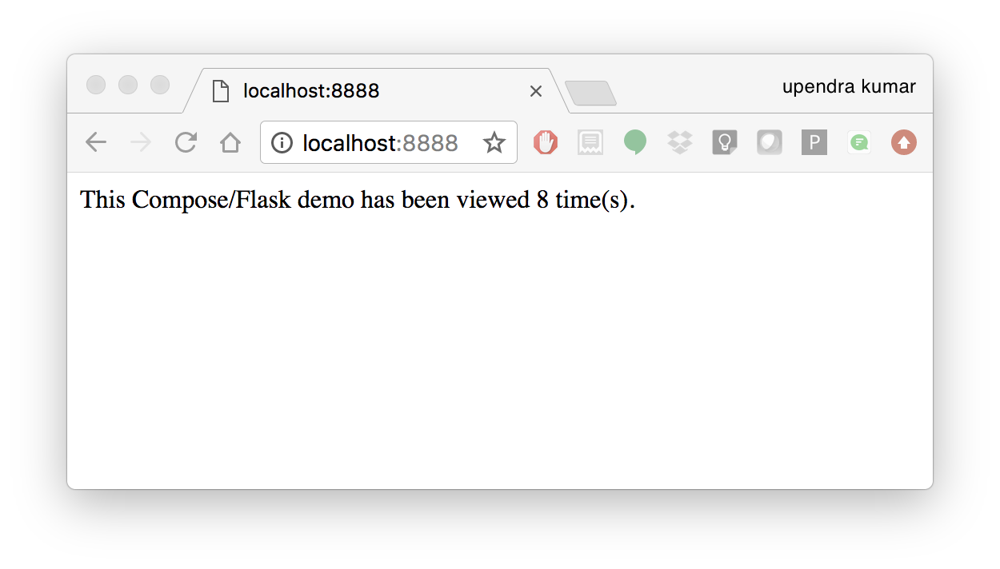

# Running multi-container Applications with Docker Compose

[:material-docker: Docker Compose](https://docs.docker.com/compose){target=_blank} is an extension of Docker which allows you to run multiple containers synchronously and in communication with one another. 

Compose allows you to define and run a multi-container service using a `Dockerfile` and a `docker-compose.yml`. 

!!! Note
        Docker for Mac and Docker Toolbox already include Compose along with
        other Docker apps, so Mac users do not need to install Compose
        separately. Docker for Windows and Docker Toolbox already include
        Compose along with other Docker apps, so most Windows users do not need
        to install Compose separately.

        For Linux users

        ``` bash
        sudo curl -L https://github.com/docker/compose/releases/download/1.25.4/docker-compose-`uname -s`-`uname -m` -o /usr/local/bin/docker-compose

        sudo chmod +x /usr/local/bin/docker-compose
        ```

Main advantages of Docker compose include:

-   Your applications can be defined in a YAML file where all the same
    options required in `docker run` are now defined (reproducibility).
-   It allows you to manage your application(s) as a single entity
    rather than dealing with starting individual containers
    (simplicity).

!!! Note
        For the sake of this example, either create your own `Dockerfile` or use the same Jupyter SciPy Notebook as in the [Advanced Section](advanced.md)

---

## Creating a `docker-compose.yml`

Let's now create a Docker Compose `.yml` that calls Jupyter Lab SciPy

1\.  Copy or create the `jupyter_compose` directory

``` bash
$ mkdir jupyter_compose && cd jupyter_compose
```

We will also create `data/` and `notebooks/` folders to stage our future
data and notebook work

``` bash
$ mkdir jupyter_compose/data
$ mkdir jupyter_compose/notebooks
```

2\.  Copy or create a `entry.sh` and a `jupyter_notebook_config.json` in
    the `jupyter_compose/` directory

`entry.sh` creates an iRODS environment JSON with the user\'s name and
CyVerse (iPlant) zone.

``` bash
#!/bin/bash

echo '{"irods_host": "data.cyverse.org", "irods_port": 1247, "irods_user_name": "$IPLANT_USER", "irods_zone_name": "iplant"}' | envsubst > $HOME/.irods/irods_environment.json

exec jupyter lab --no-browser
```

`jupyter_notebook_config.json` starts the notebook without requiring you
to add the token:

``` bash
{
  "NotebookApp": {
    "allow_origin" : "*",
    "token":"",
    "password":"",
    "nbserver_extensions": {
      "jupyterlab": true
    }
  }
}
```

3\.  create your `docker-compose.yml` in the same directory
    `jupyter_compose/`
4\.  Edit the contents of your `docker-compose.yml`

``` bash
version: "3"
services:
  scipy-notebook:
     build: .
     image:    jupyter/scipy-notebook
     volumes:
      - "./notebooks:/notebooks"
      - "./data:/data"
      - ${LOCAL_WORKING_DIR}:/home/jovyan/work
     ports:
      - "8888:8888"
     container_name:   jupyter_scipy
     command: "entry.sh"
     restart: always
```
4\.  Build the container with `docker-compose` instead of `docker build`

!!! Note
        Handling containers with Docker Compose is fairly simple

        ``` bash
        docker-compose up
        ```

        mounts the directory and starts the container

        ``` bash
        docker-compose down
        ```

        destroys the container

A brief explanation of `docker-compose.yml` is as below:

-   The web service builds from the Dockerfile in the current directory.
-   Forwards the container's exposed port to port 8888 on the host.
-   Mounts the project directory on the host to /notebooks inside the
    container (allowing you to modify code without having to rebuild the
    image).
-   `restart: always` means that it will restart whenever it fails.

---

## Running `docker-compose`

Run the container

``` bash
$ docker-compose up -d
```

And that's it! You should be able to see the application running on
`http://localhost:8888` or `<ipaddress>:8888`



## Shutting down and restarting `docker-compose`

---

## Examples that use Docker-Compose

[:material-search-web: OpenSearch](https://opensearch.org/downloads.html#docker-compose){target=_blank}

[:material-quadcopter: Web Open Drone Map (WebODM)](https://github.com/OpenDroneMap/WebODM/#run-it-on-the-cloud-google-compute-amazon-aws){target=_blank}
