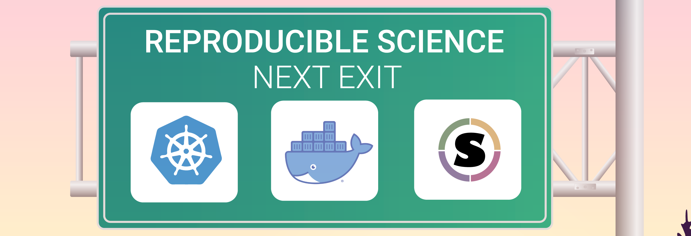

[{width="400"}](https://learning.cyverse.org){target=_blank}

# Welcome to CyVerse Container & Cloud Native Camp Documentation 

## [:material-run-fast: Go to 8/17/2023 Workshop Agenda](agenda.md)

Welcome to our documentation on containers and orchestration in academic research and education.

## Basic Container Camp

### Docker Containers for Scientific Research
- [Introduction to Docker](docker/intro.md)
- [Finding the Right Container](docker/registry.md)

### Containers on High Performance and High Throughput Computing
- [Basics of SingularityCE](singularity/intro.md)
- [Using SingularityCE on HPC and HTC](singularity/advanced.md)

## Cloud Native Camp

### Orchestration
- [Container Orchestration with Kubernetes](https://container-camp.cyverse.org/orchestration/k8s/)

### Infrastructure as Code
- [Infrastructure as Code with Hashicorp Terraform](https://container-camp.cyverse.org/orchestration/terra/)
- [CyVerse's Cloud Automation & Continuous Analysis Orchestration (CACAO)](https://container-camp.cyverse.org/orchestration/cacao/)

!!! Success "Learning Objectives"

        After completing these two paired workshops, you should be able to:
        
        * Explain why containers and orchestration are used in research computing
        * Create your own containers and deploy your own orchestrated frameworks
        * Understand how and when to use containers and IaC in your daily work

        You will also leave with

        - Understanding of how to use the most powerful public research computing infrastructure in the world via [ACCESS-CI](https://access-ci.org).
        - The ability to launch and manage distributed resources using IaC templates on commercial (AWS, GCloud, Azure) or public research (OpenStack) clouds.

        - Insight into commercial cloud services, their costs, and how to best utilize them for scientific research.

---

**Funding and Citations:**

CyVerse is generously funded by the National Science Foundation [{width="25"}](https://nsf.gov){target=_blank}. 

Here are our award numbers:

- 
- 
- 

For any utilization of our resources, please adhere to the [CyVerse citation policy](https://cyverse.org/policies/cite-cyverse).
