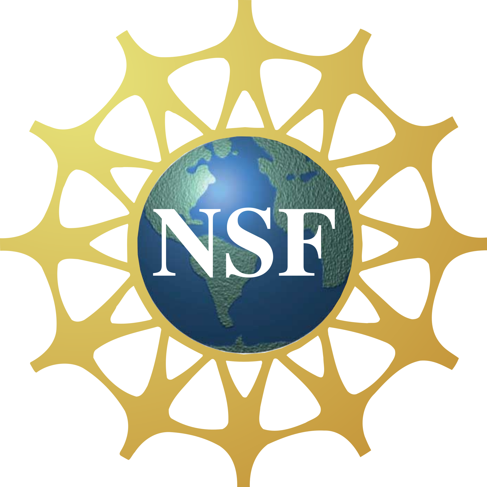

[{ width="400" }](https://learning.cyverse.org){target=_blank}

# :material-truck-cargo-container: Welcome to Container Camp :material-campfire: 

## What you will learn about in Basic Container Camp

### :material-docker: Docker Containers for scientific research

[:octicons-container-16: Introduction to Docker](docker/intro.md)

[:octicons-container-16: Finding the right container](docker/registry.md)

### :material-run-fast: Containers on High Performance and High Throughput Computing

[:octicons-container-16: Basics of SingularityCE](singularity/intro.md)

[:octicons-container-16: Using SingularityCE on HPC and HTC](singularity/advanced.md)

## What you will learn about in Cloud Native Camp

### :simple-kubernetes: Orchestration

[:simple-kubernetes: Container Orchestration with Kubernetes](https://container-camp.cyverse.org/orchestration/k8s/)

### :material-cloud-tags: Infrastructure as Code

[:simple-terraform: Infrastructure as Code with Hashicorp Terraform](https://container-camp.cyverse.org/orchestration/terra/)

[:material-cloud-tags: CyVerse's Cloud Automation & Continous Analysis Orchestration (CACAO)](https://container-camp.cyverse.org/orchestration/cacao/)

## What you leave with

- :octicons-container-24: An understanding of development, maintenence, and deployment of containers for scientific research.
- :octicons-container-24: Access to the most powerful public research computing infrastructure in the world via ACCESS-CI.

- :octicons-cloud-24: An understanding of container orchestration platforms in production environments and in testing
- :octicons-cloud-24: The ability to launch and manage distributed resources using IaC templates on commercial (AWS, GCloud, Azure) or public research (OpenStack) clouds.
- :octicons-container-24: Understanding of commercial cloud services, the costs, and how to best leverage them for scientific research

---

**Funding and Citations:**

CyVerse is funded entirely by the National Science Foundation [{width="25"}](https://nsf.gov) under Award Numbers:

    

Please cite CyVerse appropriately when you make use of our resources; see [CyVerse citation policy](https://cyverse.org/policies/cite-cyverse)
