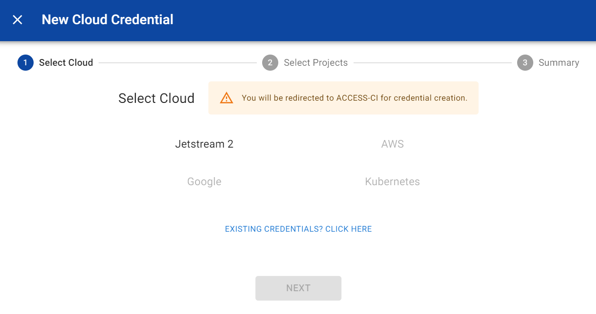
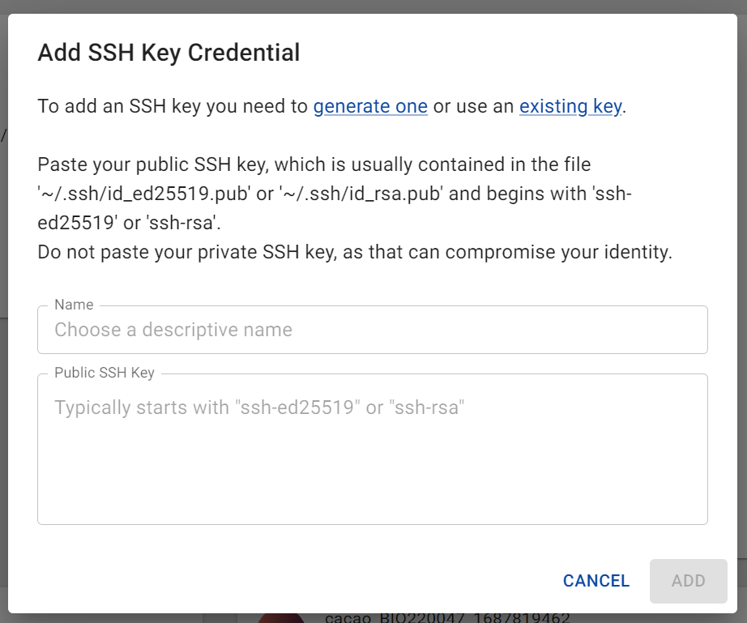
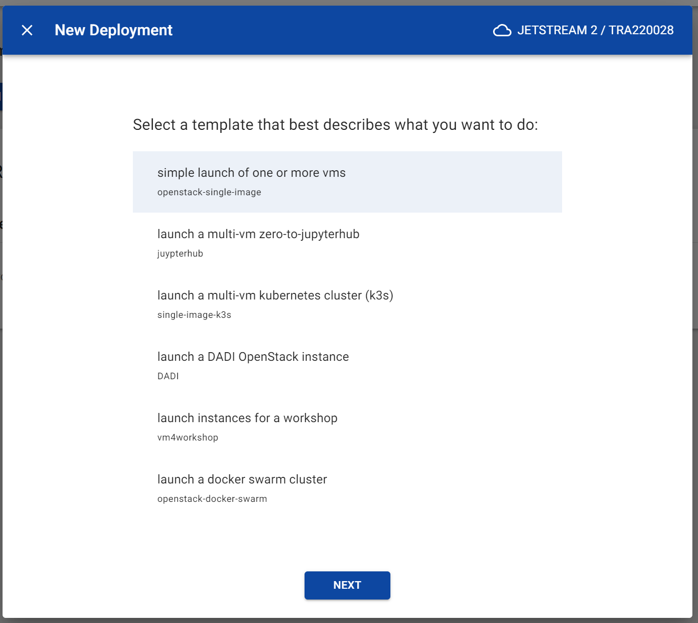
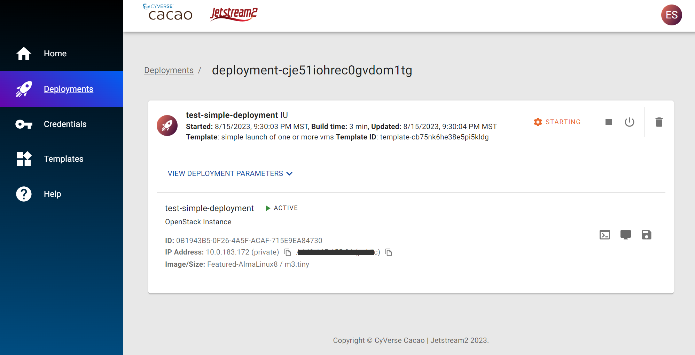

## Log into CACAO (JS2)

To start, you will need an ACCESS user account and have access to a project.
!!! Warning
    DO NOT USE FOR TODAY'S WORKSHOP

    The production site for CyVerse's CACAO is currently deployed to Jetstream2 located here: https://cacao.jetstream-cloud.org.
    
    However, do not use this site for today's workshop.

    DO NOT USE FOR TODAY'S WORKSHOP

Go to [https://cacaotest.cyverse.org](https://cacaotest.cyverse.org){target=_blank} to log in to CACAO. You will be prompted to authenticate with ACCESS.

!!! info
    You should select "ACCESS CI (XSEDE)" as your identity provider unless you linked your other identities through CILogon. If in doubt, select "ACCESS CI (XSEDE)".

### Add your Cloud Credential

Next, you will need to add cloud computing credentials. For now, the only option is Jetstream 2, but in the future, other providers like Google and AWS will be supported.

Click on Credentials on the lefthand menu bar. From the Credentials page, click the "+ Add Credential" button and select "Cloud Credential". Select Jetstream 2 and the project you would like to add. These correspond to Jetstream 2 projects you have access to.

Once your credential is added, it should show up on the Credentials page.

### Add your SSH Key

Next, you will need to add a public SSH key. This will allow you to access your VMs via SSH. If you already have an SSH key, you can use that. Otherwise, you can generate a new one.

Again, click on the "+ Add Credential" button and this time select "Public SSH Key". Enter a name and paste in your public key.

### Start a Deployment

Next, we will start a deployment onto Jetstream 2.

Click on the [:material-rocket-launch: Deployments](https://cacaotest.jetstream-cloud.org/deployments) tab on the lefthand menu bar. You will see your cloud providers and projects, and if you have multiple providers or projects, you can select them here. You should have Jetstream 2 and a project selected.

Next, click the "+ Add Deployment" button. You will see several options for default templates to launch VMs, containers, or whole clusters. We will use the first template to launch a single VM.

You will then name the deployment, select the number of instances and size of instances. For now, stick with the default Featured-AlmaLinux8 image and 1 instance of m3.tiny. You can name it whatever you want.

### Access Deployment

Once you have submitted your deployment, you can see it on the Deployments page. It will be in the "Starting" status for a few minutes. Once it is running, you can click on it to see details about it and to access it.

From here, you can click on the icons on the right to access a Web Shell or a Web Desktop (for certain images). You can also pause, shelve, or delete the deployment from here. Try opening the Web Shell, which will bring you to a command line inside your running VM.