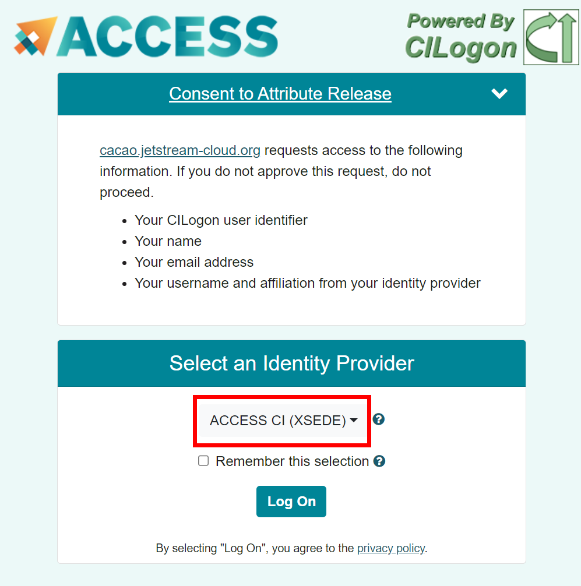

# CACAO Terraform templates on the CLI

## Overview

This tutorial will guide you through the process importing a basic terraform template into CACAO.

A more detailed version of this tutorial can be found here [https://docs.jetstream-cloud.org/ui/cacao/import_terraform_template/](https://docs.jetstream-cloud.org/ui/cacao/import_terraform_template/){target=_blank}

By the end of this tutorial, you will have imported a terraform template into CACAO and deployed it using the UI to confirm that it works.

## Prerequisites

* Basic understanding of Terraform, git, and the command line.
* An OpenStack environment with access to the API (if you need to validate any terraform changes).
* Terraform installed on your local machine or VM server (if you need to validate any terraform changes).
* An SSH key pair to access the VM server running Terraform (if you need to validate any terraform changes).

## CyVerse CACAO Browser UI

!!! Warning
    DO NOT USE FOR TODAY'S WORKSHOP

    The production site for CyVerse's CACAO is currently deployed to Jetstream2 located here: https://cacao.jetstream-cloud.org.
    
    However, do not use this site for today's workshop.

    DO NOT USE FOR TODAY'S WORKSHOP

One of CyVerse's test deployments for CACAO will be used for this exercise so that we can import a template using the newer metadata schemas, which will be deployed to production in the very near future.

The url for the CACAO site that we will use today is [https://cacaotest.cyverse.org](https://cacaotest.cyverse.org){target=_blank}

Please login to verify that your ACCESS credentials work with the CACAO test site.
!!!+ warn
    For the workshop, use the "ACCESS CI (XSEDE)" identity provider when you login.
    

1. 
## Installation of the CyVerse CACAO CLI

!!! Info
    If you are using a VM provided by the workshop, the CACAO CLI is already installed. You can skip this installation section.

The CyVerse CACAO CLI is a command line tool interact with the CyVerse CACAO API. The first step is the install the cli on your local machine or to a vm.

- [Linux download for CACAO CLI](https://gitlab.com/cyverse/cacao/-/package_files/88735155/download)
- [Windows download for CACAO CLI](https://gitlab.com/cyverse/cacao/-/package_files/88735261/download)
- [MacOS (Intel) download for CACAO CLI](https://gitlab.com/cyverse/cacao/-/package_files/88735323/download)
- [MacOS (ARM) download for CACAO CLI](https://gitlab.com/cyverse/cacao/-/package_files/88735401/download)

If you're using a VM provided by the workshop or a Linux system, you can use these instructions to install the CACAO CLI.

1. If necessary, obtain a shell or terminal on the Linux system you wish to install the CACAO CLI.
2. Copy link for "Linux download for CACAO CLI" from above.
3. `curl https://gitlab.com/cyverse/cacao/-/package_files/88735155/download --output cacao.zip`
4. `unzip cacao.zip # this will create a file cacao_linux_amd64`
5. `sudo mv cacao_linux_amd64 /usr/local/bin/cacao # optional; otherwise, add it into your path`
6. `chmod +x /usr/local/bin/cacao`

## Reviewing the Terraform template we will use to import

We will be using [https://github.com/cyverse/cacao-terraform-hello-world](https://github.com/cyverse/cacao-terraform-hello-world){target=_blank} for this tutorial.

You will find a directory called `.cacao` at the root of the template and two files:

- `metadata.json`, which contains the CACAO-specific metadata for the template
- `ui.json`, which contains the UI-specific hints for the template

The `ui.json` file is optional, and if not present, then the CACAO UI will present a default naive rendering of the template.

Details about the metadata and ui schemas can be found here: [https://docs.jetstream-cloud.org/ui/cacao/import_terraform_template/](https://docs.jetstream-cloud.org/ui/cacao/import_terraform_template/){target=_blank}

!!! warn
    The UI metadata specification is currently in flux and will likely change in the near future, especially as we get feedback from the community.

## Using the CACAO CLI

### Login to CACAO CLI
1. `cacao login --browser`
??? trip "What to do if you encounter a login issue"
    Sometimes login using the command line will fail -- a typo happens, a copy-n-paste of a token happens, using the wrong api url happens, etc -- and you need to reset your login. To reset your login, you can use the following command:

    `cacao logout`
???+ success "Expected Response"
    ```bash linenums="1" hl_lines="4"
    Please provide address of Cacao API.
    Format Should be: http://<hostname>:<port>        or    <hostname>:<port> 
    (Developers: this should match the value of API_DOMAIN in install/config.yaml followed by "/api", e.g. ca.cyverse.local/api)
    Cacao API address (http://ca.cyverse.local/api): https://cacaotest.cyverse.org/api
    ```
2. Enter the CACAO API url: `https://cacaotest.cyverse.org/api`
???+ success "Expected Response"
    ```bash linenums="4" hl_lines="2"
    Cacao API address (http://ca.cyverse.local/api): https://cacaotest.cyverse.org/api
    Please go to this URL in the browser: https://cacaotest.cyverse.org/api/user/login

    After login, you should get a JSON response, the auth token could be the value of following properties:
    - "IDToken" or "id_token" if keycloak
    - "access_token" if other auth provider

    Enter the auth token you get from browser: 
    ```
3. In your browser open the following URL (this is also echoed in the terminal, line #5): https://cacaotest.cyverse.org/api/user/login
!!!+ warn
    For the workshop, use the "ACCESS CI (XSEDE)" identity provider when you login.
    
4. You will need to grab the the "access_token" that is returned from the browser and paste the following text into the terminal: "Bearer" followed by a space and then the access token. For example, if the access_token were GOOSE, the the string you enter will be: `Bearer GOOSE`
!!! tip
    - Do not include the quotes around the token. 
    - `Bearer` is case sensitive.
    - There is one space between Bearer and the token.
Below are screenshots of what you might expect to see from Chrome and Firefox.

Chrome:

Firefox:


After pasting the "Bearer " + access_token, you should return to the shell prompt.
???+ success "Expected Response"
    ```bash linenums="11"
    Enter the auth token you get from browser: Bearer NB2HI4DTHIXASDFUINASDKLFASDHFKASDFJASDFA23FNYTHI4Z5GE3DSMRTGMYDGNJWHE3TIJTWMVZHG2LPNY6XMMROGATGY2LGMV2GS3LFHU4TAMBQGAYA
    $ 
    ```
5. To test a successful login, you can execute a cacao command, such as: `cacao provider get`

### Importing a Terraform template into CACAO

`cacao template create git <source url>  <template name> --branch <git branch> --path <path to template>`

Here are the values to enter for each:

- `<source url>`: `https://gitlab.com/stack0/cacao-tf-hello-world`
- `<template name>`: "<your student name>-hello-world" (e.g. student0001-hello-world)
- `<git branch>`: `main`
- `<path to template>`: `.`

Putting this all together, your command will look similar to this: 

```bash
cacao template create git https://gitlab.com/stack0/cacao-tf-hello-world  student0001-hello-world --branch main --path .
```

???+ success "Expected Response"
    ```bash linenums="1"
    {
        "tid": "template-cjfepm8795ktgsth2750",
        "timestamp": "2023-08-18T04:00:28.179794071Z"
    }
    ```

!!!+ note
    Save the `tid` value for later use.

### Launching a template using the CACAO UI

1. Open the CACAO UI in your browser: [https://cacaotest.cyverse.org](https://cacaotest.cyverse.org){target=_blank}
2. Click on the "Deployments" tab on the left-hand side.
3. Click on the "+ Add Deployment" button.
4. Select the "edwin's hello world example"/"student0001-hello-world" template. (Note: the subname of the template will be different for you.)
5. Click the "Next" button.
6. Fill out the Parameters
    1. `Choose Region`: leave as default
    2. `Instance name`: enter your student name (e.g. student0001) + date e.g. `student0001-2021-08-18`
    3. `Image`: select "Featured-Ubuntu22"
    4. `Size`: leave as default

7. Click the "Next" button.
8. After reviewing the summary, click the "Submit" button.
9. You will be listed on the "Deployments" page. You can click on the deployment to see the status of the deployment.

While you are waiting, questions or we can begin the next section, "What if you want to customize a template?"

### Cleaning up
!!!+ warn
    You will not be able to delete a template if there are any active deployments using it.
1. Delete the deployment in the UI or cli (`cacao deployment delete <deployment id`).
2. `cacao template delete <template id>`
???+ success "Expected Response"
    ```bash linenums="1"
    {
        "id": "template-cjfepmuf95ktgsth2750",
        "tid": "template-cjfepmuf95ktgsth2750",
        "timestamp": "2023-08-18T04:36:07.420852435Z"
    }
    ```


### What if you make changes to a template and want to use it for new deployments?

Answer: You do not need to do anything. The CACAO UI will automatically detect changes to the template on the configure branch and will use the latest branch code new deployments.

### What if you make metadata changes  to a template (e.g. `.cacao/metadata.json` or `.cacao/ui.json`) and want to use it for new deployments?

Answer: `cacao template sync <tid>`

## What if you want to customize a template you don't own but is public?

If there is time, we can go through this section. Otherwise, you can try this on your own.

1. Fork the template into your own github or gitlab account
2. Add a `.cacao/metadata.json` and `.cacao/ui.json` to your forked template
3. Import the template using the `cacao template create git` command.


