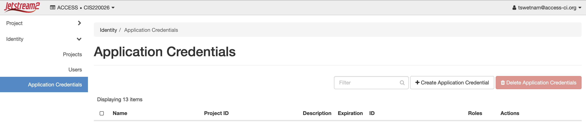
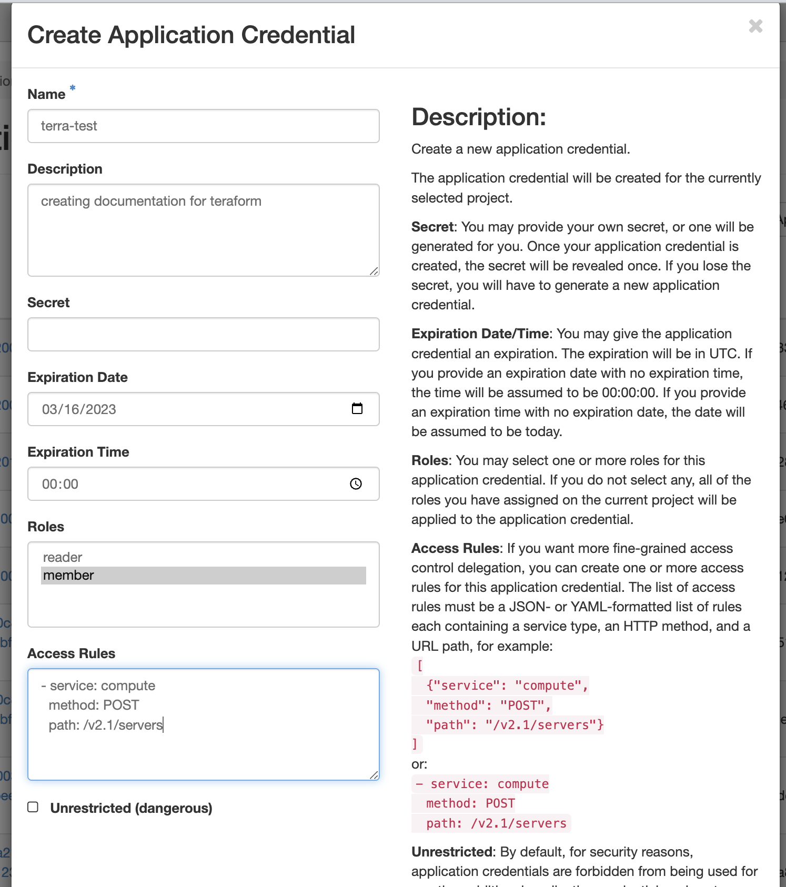
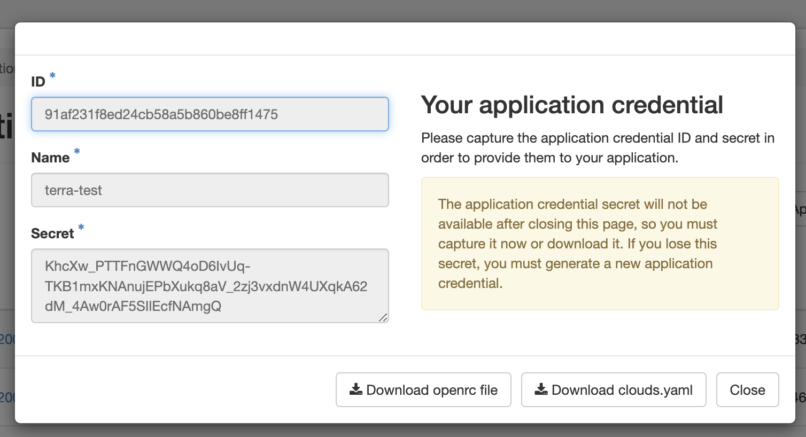

# Introduction to Terraform

[:simple-terraform: Terraform](https://www.terraform.io/){target=_blank} is an open-source infrastructure-as-code (IaC) software tool created by [HashiCorp](https://www.hashicorp.com/){target=_blank}.

??? Info "What is Infrastructure-as-Code (IaC)?"

    "Infrastructure as code (IaC) is the process of managing and provisioning computer data centers through machine-readable definition files, rather than physical hardware configuration or interactive configuration tools." - [:simple-wikipedia: Wikipedia](https://en.wikipedia.org/wiki/Infrastructure_as_code){target=_blank}

    IaC tools allow you to manage infrastructure with configuration files rather than through a graphical user interface. IaC allows you to build, change, and manage your infrastructure in a safe, consistent, and repeatable way by defining resource configurations that you can version, reuse, and share. -- [:simple-terraform: Terraform Documentation](https://developer.hashicorp.com/terraform/tutorials/aws-get-started/infrastructure-as-code){target=_blank}

## Overview

This basic tutorial will guide you through setting up a Terraform project and deploying virtual machines (VMs) as infrastructure on OpenStack Clouds.  

By the end of this tutorial, you will have created a VM instance with an associated SSH keypair.

!!! Success "Goals"

    :material-play: Understand orchestration for deployment to OpenStack cloud (Jetstream2)

    :material-play: Understand the benefits of Terraform

    :material-play: Ability to perform basic deployments on OpenStack using Terraform

    :material-play: Ability to perform provisioning of deployed OpenStack resources through Terraform

    ??? Failure "Things we won't cover"

        :material-play: OpenStack API
        
        :material-play: All of Terraform's features


## Pre-requisites

* Basic understanding of [:simple-openstack: OpenStack](https://www.openstack.org/){target=_blank} and VMs

  * Access to an OpenStack cloud (we will use [Jetstream2](https://docs.jetstream-cloud.org/){target=_blank})

  * Optional: your own allocation to Jetstream2 on [NSF ACCESS-CI](https://allocations.access-ci.org/){target=_blank}

* [:simple-terraform: Terraform](https://developer.hashicorp.com/terraform/downloads){target=_blank} installed on your local machine

* Ability to create an SSH key pair to access the VM

??? Info "Terminology"

    **:material-play: Ansible** - is a suite of software tools that enables infrastructure as code

    **:material-play: Deploy** - to create a cloud resource or software
   
    **:material-play: Infrastructure** - is the collection of hardware and software elements such as computing power, networking, storage, and virtualization resources needed to enable cloud computing

    **:material-play: Orchestration** - is the automated configuring, coordinating, and managing of computer systems and software

    **:material-play: Playbook** - are a list of tasks that automatically execute against a host

    **:material-play: Provision** - making changes to a VM including updating the operating system, installing software, adding configurations

    **:material-play: Terraform** - is an infrastructure as code tool that lets you build, change, and version cloud and on-prem resources safely and efficiently


### Getting onto :simple-openstack: OpenStack Cloud

??? Info "What is OpenStack?"

    [:simple-openstack: OpenStack](https://www.openstack.org/){target=_blank} is an open source cloud computing infrastructure software project and is one of the three most active open source projects in the world.

    OpenStack clouds are managed by individuals and institutions on their own bare-metal hardware. 

[{width=200}](https://allocations.access-ci.org/){target=_blank} 

If you do not have an account, go to [https://allocations.access-ci.org/](https://allocations.access-ci.org/){target=_blank} and begin the process by requesting an "Explore" start-up allocation. 

ACCESS is the NSF's management layer for their research computing network (formerly called TerraGrid and XSEDE) which includes high performance computing, high throughput computing, and research clouds like Jetstream2. 

[{width=200}](https://docs.jetstream-cloud.org/general/access/){target=_blank} 

Jetstream2 is a public research cloud which uses OpenStack as its management layer. 

CyVerse is developing a User Interface for Jetstream2 called [CACAO (Cloud Automation & Continuous Analysis Orchestration)](https://cacao.jetstream-cloud.org/help){target=_blank}. Beneath its hood is Terraform. CACAO can also be used from the CLI (which we will [show in a later lesson](./cacao_terra.md)).

### :simple-terraform: Terraform installation

[:simple-terraform: Official Documentation](https://developer.hashicorp.com/terraform/tutorials/aws-get-started/install-cli#install-terraform){target=_blank}

??? Tip "Mac OS X Installation"

    Instructions for Mac OS X installation

    If you're on OS X, you can use [brew](https://brew.sh/) to install with the following commands:

    ```bash
    # install terraform -- taken from https://learn.hashicorp.com/tutorials/terraform/install-cli
    brew tap hashicorp/tap && brew install hashicorp/tap/terraform

    # install ansible and jq (for processing terraform's statefile into an ansible inventory)
    brew install ansible jq
    ```

??? Tip "Linux Installation"

    Instructions for Ubuntu 22.04 installation

    ```bash
    wget -O- https://apt.releases.hashicorp.com/gpg | gpg --dearmor | sudo tee /usr/share/keyrings/hashicorp-archive-keyring.gpg
    echo "deb [signed-by=/usr/share/keyrings/hashicorp-archive-keyring.gpg] https://apt.releases.hashicorp.com $(lsb_release -cs) main" | sudo tee /etc/apt/sources.list.d/hashicorp.list
    sudo apt update && sudo apt install terraform
    ```

    Install Ansible & J Query

    ```bash
    sudo apt-add-repository ppa:ansible/ansible
    sudo apt update & sudo apt install -y ansible jq
    ```

Confirm installation

```bash
terraform
```

## Generate an OpenStack Credential for Terraform

Log into OpenStack's Horizon Interface

**Step 1** Log into OpenStack's Horizon Interface and create application credentials

Generate an `openrc.sh` file in Jetstream2 Horizon Interface ([https://js2.jetstream-cloud.org](https://js2.jetstream-cloud.org)), 

Select the "Identity" then "Application Credentials" option in the menu (left side)

Select "+ Create Application Credential" button on right



Give your new credentials a name and description, leave most of the fields blank



Download the new crededential `openrc.sh` file to your local

!!! Tip "**Important**" 
    
    Do not close the Application Credentials window without copying the `secret` or downloading the `openrc.sh` file.

    

### Create an SSH keypair with OpenStack

??? Tip "Creating a SSH key"

    To create an SSH key on an Ubuntu 22.04 terminal, you can follow these steps:

    **Step 1:** Open your terminal and type the following command to generate a new SSH key pair:

    ```bash
    ssh-keygen -t rsa -b 4096
    ```

    **Step 2:** When prompted, press "Enter" to save the key in the default location, or enter a different filename and location to save the key.

    Enter a passphrase to secure your key. This passphrase will be required to use the key later.

    Once the key is generated, you can add it to your SSH agent by running the following command:

    ```bash
    eval "$(ssh-agent -s)"
    ssh-add ~/.ssh/id_rsa
    ```

    **Step 3:** Copy the public key to your remote server by running the following command, replacing "user" and "server" with your username and server address:

    ```bash
    ssh-copy-id <user>@<server-ip>
    ```

    **create_ssh_script.sh:**

    ```bash
    #!/bin/bash

    echo "Generating SSH key pair..."
    ssh-keygen -t rsa -b 4096

    echo "Adding key to SSH agent..."
    eval "$(ssh-agent -s)"
    ssh-add ~/.ssh/id_rsa

    read -p "Enter your remote server username: " username
    read -p "Enter your remote server IP address: " server

    echo "Ready to copy your new public key to a remote server:"

    ssh-copy-id username@server

    echo "SSH key setup complete!"
    ```

    Save the script to a file, make it executable with the following command:

    ```bash
    chmod +x create_ssh_script.sh
    ```

    run it with the following command:

    ```bash
    ./create_ssh_script.sh
    ```

Check to make sure you have a public key in the `~/.ssh/` directory, it should have the extension `.pub`

```bash
ls ~/.ssh/
```

Create the keypair to OpenStack

```bash
openstack keypair create --public-key ~/.ssh/id_rsa.pub tswetnam-terraform-key
```

You can now check in OpenStack for the new keypair here: [https://js2.jetstream-cloud.org/project/key_pairs](https://js2.jetstream-cloud.org/project/key_pairs){target=_blank}

## Initialize your Terraform project

Create a new project folder for our configuration files.

```bash
mkdir ~/terraform
```

Copy the `openrc.sh` file you downloaded from OpenStack into the new folder.

```bash
cp *-openrc.sh ~/terraform/
```

Change Directory into your new `terraform/` folder and `source` the `openrc.sh` file to create its environmental variables locally.

By sourcing this file, you avoid placing sensitive information about yourself into your code. 

```bash
source *-openrc.sh
```

Now, you are ready to initialize the Terraform project

```bash
cd terraform
terraform init
```

Expected output:

`Terraform initialized in an empty directory!`

`The directory has no Terraform configuration files. You may begin working with Terraform immediately by creating Terraform configuration files.`

### Configuration files

Terraform code is written in HCL (Hashicorp Configuration Language), and its configuration files typically end in the `.tf` file extension. 

Configurations can either be split into multiple files or maintained in a single file.

#### File Organization

```css
terraform-project/
├── main.tf
├── variables.tf
├── outputs.tf
├── provider.tf
└── modules/
    ├── network/
    │   ├── main.tf
    │   ├── variables.tf
    │   └── outputs.tf
    └── compute/
        ├── main.tf
        ├── variables.tf
        └── outputs.tf
```

**:simple-terraform: Main Configuration File (`main.tf`):** - contains the primary infrastructure resources and configurations for virtual machines, networks, and storage.

**:simple-terraform: Variables File (`variables.tf`):** - defines all the input variables used in the configuration. Declare variables with default values or leave them empty for required user input. Include descriptions for each variable to provide context.

**:simple-terraform: Outputs File (`outputs.tf`):** - defines the outputs Terraform displays after applying the Main and Variables configuration. Includes: IP addresses, DNS names, or information for resources.

**:simple-terraform: Provider Configuration File (`provider.tf`):** - includes the provider(s) used in the configuration, such as OpenStack (on commerical cloud: Amazon Web Services (AWS), Azure, or Google Cloud Platform(GCP)) along with their authentication and regional settings.

**:simple-terraform: Modules and Reusable Configurations:** - create separate `.tf` files for reusable modules and configurations. Reuse across multiple projects or within the same project on multiple VMs.

## Terraform configuration files.

Create the `main.tf` file in the `~/terraform/` directory

#### :simple-terraform: `main.tf`

```bash
terraform {
  required_version = ">= 0.14.0"
  required_providers {
    openstack = {
      source  = "terraform-provider-openstack/openstack"
      version = "~> 1.47.0"
    }
  }
}

provider "openstack" { }
```

The `main.tf` file has just the basics for calling out to an OpenStack provider - we created the necessary configurations for this in the prior steps by sourcing the `*-openrc.sh` file and running `terraform init`. 

#### :simple-terraform: `provider.tf`

the `provider.tf` is used to configure the OpenStack or commercial cloud provider:

```bash
terraform {
  required_providers {
    openstack = {
      source  = "terraform-provider-openstack/openstack"
      version = "~> 1.45"
    }
  }
}

provider "openstack" {
  user_name   = var.openstack_user_name
  password    = var.openstack_password
  tenant_name = var.openstack_tenant_name
  auth_url    = var.openstack_auth_url
}
```

#### :simple-terraform: `variables.tf`

`variables.tf` can also be called `inputs.tf` 

Here we need to go back to OpenStack and get a couple of additional variables:

(1) we need the name of your paired SSH key

```bash
variable "vm_number" {
  # specify the number of VMs you want to launch
  default = "1"
}

variable "public_key" {
  # replace this with the name of the public ssh key you uploaded to Jetstream 2
  # https://docs.jetstream-cloud.org/ui/cli/managing-ssh-keys/
  default = "[REPLACE-your-ssh-key-here]>"
}

variable "image_id" {
  # replace with the OS image id of the ubuntu iso you want to use
  # https://js2.jetstream-cloud.org/project/images select the 
  default = "[REPLACE-WITH-VALID-ID]">
}

variable "network_id" {
  # replace this with the id of the public interface on JS2 in Project / Network / Networks / public 
  # https://js2.jetstream-cloud.org/project/networks/ 
  default = "[REPLACE-WITH-VALID-PUBLIC-ID]"
}
```

#### :simple-terraform: `network.tf`

```bash
################
#Networking
################
#creating the virtual network
resource "openstack_networking_network_v2" "terraform_network" {
  name = "terraform_network"
  admin_state_up  = "true"
}

#creating the virtual subnet
resource "openstack_networking_subnet_v2" "terraform_subnet1" {
  name = "terraform_subnet1"
  network_id  = "${openstack_networking_network_v2.terraform_network.id}"
  cidr  = "192.168.0.0/24"
  ip_version  = 4
}
# setting up virtual router
resource "openstack_networking_router_v2" "terraform_router" {
  name = "terraform_router"
  admin_state_up  = true
  # id of public network at JS1/2
  external_network_id = var.network_id
}
# setting up virtual router interface
resource "openstack_networking_router_interface_v2" "terraform_router_interface_1" {
  router_id = "${openstack_networking_router_v2.terraform_router.id}"
  subnet_id = "${openstack_networking_subnet_v2.terraform_subnet1.id}"
}
```

#### :simple-terraform: `security.tf`

```bash
################
#Security section
################
#creating security group
resource "openstack_compute_secgroup_v2" "terraform_ssh_ping_centos" {
  name = "terraform_ssh_ping"
  description = "Security group with SSH and PING open to 0.0.0.0/0"

  #ssh rule
  rule{
    ip_protocol = "tcp"
    from_port  =  "22"
    to_port    =  "22"
    cidr       = "0.0.0.0/0"
  }
  rule {
    from_port   = -1
    to_port     = -1
    ip_protocol = "icmp"
    cidr        = "0.0.0.0/0"
  }

}
```

#### :simple-terraform: `ubuntu.tf`

```bash
################
#VMs
################

# creating Ubuntu20 instance
resource "openstack_compute_instance_v2" "Ubuntu20" {
  name = "terraform_Ubuntu20_${count.index}"
  # ID of Featured-Ubuntu20
  image_id  = var.image_id
  # use the flavor names to specify the size of the VM
  flavor_name   = m3.quad
  # this public key is set above in security.tf section
  key_pair  = var.public_key
  security_groups   = ["terraform_ssh_ping", "default"]
  count     = var.vm_number
  metadata = {
    terraform_controlled = "yes"
  }
  network {
    name = "terraform_network"
  }
  depends_on = [openstack_networking_network_v2.terraform_network]

}
# creating floating ip from the public ip pool
resource "openstack_networking_floatingip_v2" "terraform_floatip_ubuntu20" {
  pool = "public"
    count     = var.vm_number
}

# assigning floating ip from public pool to Ubuntu20 VM
resource "openstack_compute_floatingip_associate_v2" "terraform_floatubntu20" {
  floating_ip = "${openstack_networking_floatingip_v2.terraform_floatip_ubuntu20[count.index].address}"
  instance_id = "${openstack_compute_instance_v2.Ubuntu20[count.index].id}"
    count     = var.vm_number
}

################
#Output
################


output "floating_ip_ubuntu20" {
  value = openstack_networking_floatingip_v2.terraform_floatip_ubuntu20.*.address
  description = "Public IP for Ubuntu 20"
}
```

#### :simple-terraform: `terraform.tfvars`

 A `terraform.tfvars` file is used to define the values of input variables. It can also be renamed `*.auto.tfvars`.
 
 It serves as a convenient way to store and manage variable values that you don't want to hardcode in your `.tf` files or provide via command-line arguments. 
 
 By using a `terraform.tfvars` file, you can easily customize and update the variable values for different environments or scenarios.

 The file should contain key-value pairs, where the key is the variable name and the value is the corresponding variable value. 
 
 The syntax for defining variables in the `terraform.tfvars` file can be either HCL or JSON.

Add your OpenStack credentials and other required information to `terraform.tfvars`:

In HCL:

```bash
openstack_user_name   = "your-openstack-username"
openstack_password    = "your-openstack-password"
openstack_tenant_name = "your-openstack-tenant-name"
openstack_auth_url    = "your-openstack-auth-url"         
```

In JSON:
```json
{
  "openstack_user_name": "your-openstack-username",
  "openstack_password": "your-openstack-password",
  "openstack_tenant_name": "your-openstack-tenant-name",
  "openstack_auth_url": "your-openstack-auth-url"
}         
```

When you run `terraform apply` or `terraform plan`, Terraform will automatically load the values from the `terraform.tfvars` file if it exists in the working directory. 

You can also create multiple `.tfvars` files and specify which one to use by passing the `-var-file` flag when executing Terraform commands:

```bash
terraform apply -var-file="custom.tfvars"
```

## Terraform Commands

#### :simple-terraform: init

[`terraform init`](https://developer.hashicorp.com/terraform/cli/commands/init) - initializes a working directory containing terraform `.tf` or `.tfvars` files

#### :simple-terraform: plan

[`terraform plan`]() - generates the configuration based on the `.tf` files in the initialized directory

#### :simple-terraform: apply

[`terraform apply`]() - launches the deployment 

#### :simple-terraform: destroy

[`terraform destroy`]() - destroys the current deployment
