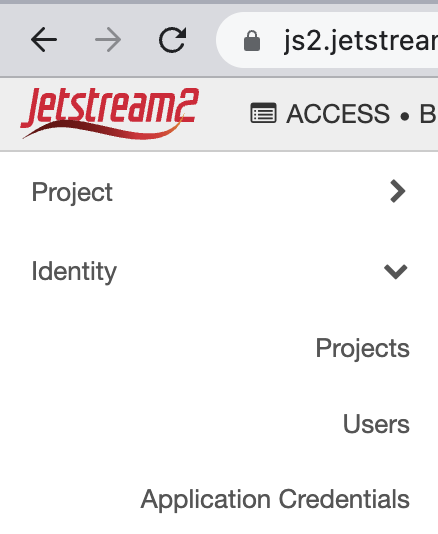

# Introduction to Terraform

[:simple-terraform: Terraform](https://www.terraform.io/){target=_blank} is an open-source infrastructure-as-code software tool created by [HashiCorp](https://www.hashicorp.com/){target=_blank}.

??? Info "What is Infrastructure-as-Code (IaC)?"

    "Infrastructure as code (IaC) is the process of managing and provisioning computer data centers through machine-readable definition files, rather than physical hardware configuration or interactive configuration tools." - [:simple-wikipedia: Wikipedia](https://en.wikipedia.org/wiki/Infrastructure_as_code){target=_blank}

### Installation

Terraform needs a dedicated resource to manage its deployments. 

[:simple-terraform: Terraform](https://developer.hashicorp.com/terraform/downloads){target=_blank} - install Terraform on your server

[:simple-ansible: Ansible](){target=_blank} - 

Optional: [:simple-visualstudiocode: VS Code Terraform Extension](https://marketplace.visualstudio.com/items?itemName=HashiCorp.terraform){target=_blank} - add VS Code extension

Instructions for Ubuntu 22.04 installation

```{bash}
wget -O- https://apt.releases.hashicorp.com/gpg | gpg --dearmor | sudo tee /usr/share/keyrings/hashicorp-archive-keyring.gpg
echo "deb [signed-by=/usr/share/keyrings/hashicorp-archive-keyring.gpg] https://apt.releases.hashicorp.com $(lsb_release -cs) main" | sudo tee /etc/apt/sources.list.d/hashicorp.list
sudo apt update && sudo apt install terraform
```

Install Ansible

```{bash}
sudo pip install --upgrade ansible-core==2.13.8
```


??? Info "Basic Operations"

    Setting up your server

    The basic setup is as follows:

    1. `git clone` a repository with a terraform plan, e.g. 

    2. `cd` into the repository

    3. Download your Jetstream-2 or other OpenStack Cloud `openrc` file into the repo 

        Go to [https://js2.jetstream-cloud.org/project/](https://js2.jetstream-cloud.org/project/){target=_blank}

    4. Run `source openrc.sh` in a CLI 

    5. Initalize Terraform with `terraform init`

    6. See what changes Terraform wants to make to your infrastructure with `terraform plan`

    7. Apply the changes with `terraform apply`

    **Terraform on Jetstream-2**

    [Jetstream-2 Terraform Documentation](https://docs.jetstream-cloud.org/general/terraform/){target=_blank}

## CyVerse CACAO Browser UI

[CyVerse's CACAO (Cloud Automation & Continuous Analysis Orchestration)](https://cacao.jetstream-cloud.org/help){target=_blank}

### CyVerse CACAO CLI

#### Start-up the Terraform Server

We need to run terraform from somewhere, this should be a permanent instance which is not pre-emptable (suggest a tiny VM on Jetstream2)

#### Running Terraform

**Step 1** Create Authentication Credentials

Generate an `openrc.sh` file in Jetstream2 Horizon Interface ([https://js2.jetstream-cloud.org](https://js2.jetstream-cloud.org)), 

Open the "Application Credentials" option on bottom of of the Horizon menu (upper left)

{width=200}

Select "+ Create Application Credential" button on right


Give your new credentials a name and description


Download the new crededential `openrc` file 

!!! Tip "**Important**" 
    
    Do not close the Application Credentials window without copying the `secret` or downloading the `


**Step 2** Clone the CACAO z2jh repository


```git clone https://gitlab.com/stack0/cacao-tf-jupyterhub.git```

** Step 3** Initialize Terraform in the repository

Change directory to the repo: `cd cacao-tf-jupyterhub`

Run 

```terraform init```

**Step 3** Source the OpenRC shell script

```source *-openrc.sh```

6. `terraform apply -auto-approve`

7. when done, `terraform destroy -auto-approve`

#### Editing Terraform Variables file (.tfvars)


??? Tip "Zero to JupyterHub with Kubernetes Deployment"

    Example Terraform variables (.tfvars) file for deploying [Zero to JupyterHub with K3s (Rancher)]()
        
    Based on the [Zero to JupyterHub with Kubernetes](https://z2jh.jupyter.org/en/stable/)

    ```{yaml}

    ### Set the floating_ip address for DNS redirections ###

    # jupyterhub_floating_ip="149.165.152.223"

    ### Set up the Security Groups (re=used from Horizon) ###
    
    security_groups = ["default","cacao-default","cacao-k8s"]

    ### Give the Deployment a Name (shorter is better) ###

    instance_name = "jh-prod"

    ### Horizon Account User ID and ACCESS-CI Project Account ###
    
    username = "${USER}"
    project = "BIO220085"

    # Horizon SSH key-pair
    keypair = "${USER}-default"

    ### Set the Number of Instances (Master + Workers) ###

    instance_count = 6

    # Storage Volume Size in GiB 
    jh_storage_size=1000

    # Storage Volume directory path
    jh_storage_mount_dir="/home/shared"

    # OS type
    image_name = "Featured-Ubuntu22"

    # Worker VM Flavor
    flavor = "m3.medium"

    # Master VM Flavor (m3.medium or larger is recommended)
    flavor_master = "m3.medium"

    ### Run JupyterHub on Master Node ###
    
    do_jh_singleuser_exclude_master="true"
    
    # Jetstream2 Region
    region = "IU"

    # VM image (root disk) sizes
    root_storage_size = 100
    root_storage_type = "volume"
    
    # Enable GPUs (true/false) - use "true" with "g3" flavors
    do_enable_gpu=false

    ### Zero 2 JupyterHub with K3s Rancher Configuration ###

    jupyterhub_deploy_strategy="z2jh_k3s"

    ### Ansible-based Setup for JupyterHub ###
    
    do_ansible_execution=true

    ### CPU usage per user utilization 10000m = 100% of 1 core ###
    
    jh_resources_request_cpu="3000m"
    
    ### Memory RAM per-user requirement in Gigibytes ###
    
    jh_resources_request_memory="10Gi"
        
    ### Set Power Status ###

    power_state = "active"
    # power_state = "shelved_offloaded"

    ### Pre-Cache images? ###

    do_jh_precache_images=false

    user_data = ""

    ### JupyterHub Configurations ###

    # set the type of authentication, comment out Dummy or OAuth
    # OAuth-type (GitHub Authentication)
    # jupyterhub_oauth2_clientid="02b0a98c5d1547101514"
    # jupyterhub_oauth2_secret="ac658055d848e787c31803afd973a05fbdb98f64"
    
    # Dummy-type Authentication
    jupyterhub_authentication="dummy"

    # set the dummy username password
    jupyterhub_dummy_password="password"

    # Specify the JupyterHub admins
    jupyterhub_admins="${USER}"
    
    # add JupyterHub student account usernames 
    jupyterhub_allowed_users="${USER}, student1, student2, student3, student4"

    ### Select a JupyterHub-ready image ###
    
    #jupyterhub_singleuser_image="harbor.cyverse.org/vice/jupyter/pytorch"

    jupyterhub_singleuser_image="jupyter/datascience-notebook"

    jupyterhub_singleuser_image_tag="latest"

    ```